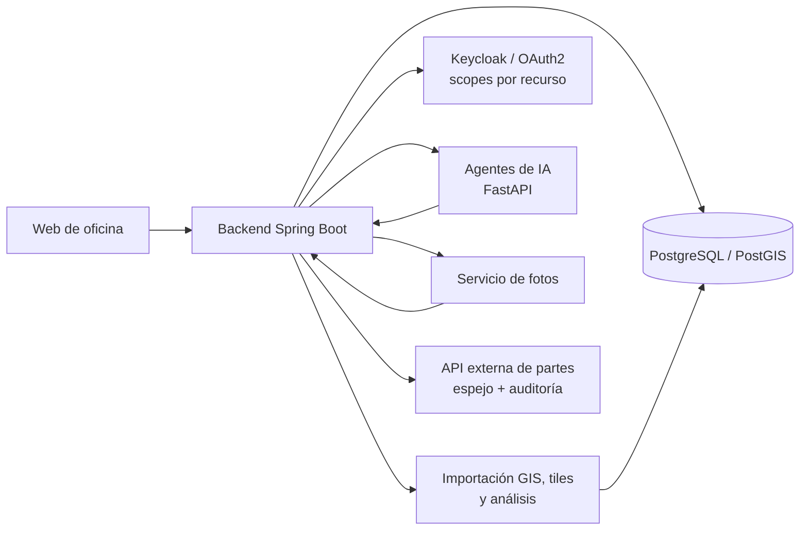

# Rabie Samadi — Backend, GIS e IA en SaaS de producción

Construyo plataformas SaaS que están en producción: backend, GIS, agentes de IA y la parte de seguridad que aparece en cuanto hay usuarios y clientes reales.

Aquí tienes los write-ups de lo que he hecho, sin código propietario, sin datos de cliente y sin interioridades de producción. Solo la arquitectura y las decisiones.

## Casos

Los dos productos:

- [AppFibra — SaaS GIS, agentes de IA y seguridad](case-studies/appfibra-saas-gis-ai.md)
- [WilayaCenter Pharma — ERP/TPV para farmacia](case-studies/wilayacenter-pharma-saas.md)

Cómo trabajo, con las cifras de cada cosa:

- [Agentes de IA sobre MCP — tools en vez de text-to-SQL](case-studies/mcp-agents-semantic-tools.md)
- [Documentación fotográfica — OCR, geocoding y borrado de marcas](case-studies/photodoc-silent-failures.md)
- [Rendimiento y capacidad: diagnóstico en navegador y base de datos](case-studies/measured-performance.md)
- [Pipeline de CI — qué comprobaciones pueden bloquear](case-studies/ci-pipeline-what-blocks.md)
- [Trampas conocidas](trampas-conocidas.md)

De un vistazo:

- [Diagramas de arquitectura](diagrams/appfibra-platform.md)
- [Resumen en 60 segundos](presentation/rabie-samadi-technical-portfolio.md)

## Lo que sé hacer

- **Backend**: Java 17, Spring Boot, APIs REST y SSE, PostgreSQL. En producción, no en un tutorial.
- **GIS**: PostGIS, vector tiles, importación de SHP, CRS/EPSG. Pensado para trabajo de campo, no para pintar un mapa bonito.
- **Agentes de IA sobre MCP**: FastAPI, streaming, historial persistente, y un circuito que convierte el feedback negativo de producción en casos de evaluación, para saber si un cambio de prompt ha mejorado algo o solo lo parece.
- **IA aplicada a trabajo real**: OCR de albaranes de proveedor, resúmenes de nómina en lenguaje natural, búsqueda de producto por lenguaje natural.
- **Seguridad**: Spring Security, Keycloak/OAuth2, RBAC, CSRF/CORS, RLS, scopes por recurso, autenticación M2M entre servicios.
- **GIS multicliente**: capas configurables, resolvers por cliente, KPIs precalculados, filtrado empujado al backend.
- **CI con seguridad desde el principio**: GitHub Actions con escaneo de secretos sobre todo el historial, SAST, auditoría de dependencias y SBOM. El contexto de Spring arranca contra un contenedor PostGIS real, y sobre ese mismo contenedor se comprueban los planes de ejecución: si alguien borra un índice, el pull request se pone en rojo.
- **Rendimiento medido, no intuido**: profiling, microbenchmarks, pruebas de carga con k6, planes leídos con `EXPLAIN (ANALYZE, BUFFERS)`. Incluyendo revertir decisiones de arquitectura mías cuando los números las contradicen.
- **De principio a fin**: requisitos, arquitectura, implementación, despliegue y mantenerlo funcionando después.

## Datos de producción

- 2 plataformas SaaS en producción, en sectores distintos (infraestructura FTTH y ERP/TPV de farmacia), las dos construidas y mantenidas por mí.
- +200 municipios y +200.000 homes cubiertos por los datos de red de la plataforma FTTH.
- 3 clientes industriales activos.
- 50-100 usuarios concurrentes en el día a día.
- Punto de saturación medido entre 150 y 300 usuarios concurrentes: a 300 se cruzaron los seis umbrales, a 187 req/s. Con ese número se dimensionó la máquina de producción.
- 3 servicios internos que se hablan entre sí con autenticación M2M.
- Autorización a nivel de recurso, hasta proyecto o ciudad.

## Stack

Java 17 · Spring Boot · Spring Security · Keycloak/OAuth2 · React · PostgreSQL · PostGIS · FastAPI · Python · Model Context Protocol (MCP) · Google Cloud Document AI · Google Gemini · Amazon Textract · Amazon Bedrock · MapLibre/Leaflet · Capacitor · Power BI · GitHub Actions · Semgrep · Testcontainers · k6

## Arquitectura, de un vistazo

