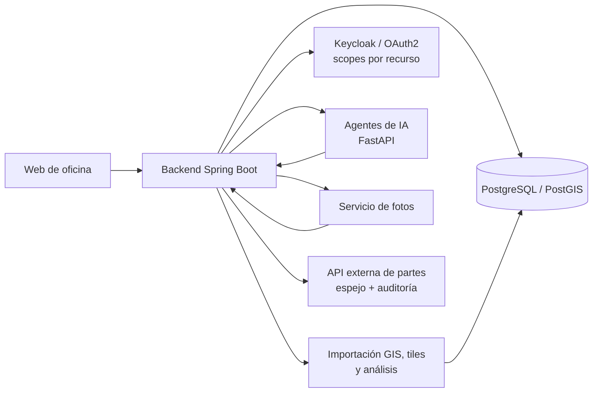

# Rabie Samadi: backend, GIS e IA en SaaS de producción

Desarrollo y mantengo plataformas SaaS en producción: backend, GIS, agentes de IA y la capa de seguridad multicliente.

Write-ups saneados: sin código propietario, sin datos de cliente y sin detalles de infraestructura. Arquitectura, decisiones y mediciones.

## Casos

Productos:

- [AppFibra: SaaS GIS, agentes de IA y seguridad](case-studies/appfibra-saas-gis-ai.md)
- [WilayaCenter Pharma: ERP/TPV para farmacia](case-studies/wilayacenter-pharma-saas.md)

Áreas técnicas:

- [Agentes de IA sobre MCP: tools en lugar de text-to-SQL](case-studies/mcp-agents-semantic-tools.md)
- [Documentación fotográfica: OCR, geocoding y borrado de marcas](case-studies/photodoc-ocr-geocoding.md)
- [Rendimiento y capacidad: diagnóstico en navegador y base de datos](case-studies/measured-performance.md)
- [Pipeline de CI: qué comprobaciones bloquean](case-studies/ci-pipeline-what-blocks.md)
- [Trampas conocidas](trampas-conocidas.md)

Resumen:

- [Diagramas de arquitectura](diagrams/appfibra-platform.md)
- [Resumen en 60 segundos](presentation/rabie-samadi-technical-portfolio.md)

## Capacidades técnicas

- **Backend**: Java 17, Spring Boot, APIs REST y SSE, PostgreSQL.
- **GIS**: PostGIS, vector tiles, importación de SHP/GPKG/DXF, CRS/EPSG.
- **Agentes de IA sobre MCP**: FastAPI, streaming, historial persistente, y un circuito que convierte el feedback negativo de producción en casos de evaluación, para medir el efecto de cada cambio de prompt.
- **IA aplicada a trabajo real**: OCR de albaranes de proveedor, resúmenes de nómina en lenguaje natural, búsqueda de producto por lenguaje natural.
- **Seguridad**: Spring Security, Keycloak/OAuth2, RBAC, CSRF/CORS, RLS, scopes por recurso, autenticación M2M entre servicios.
- **GIS multicliente**: capas configurables, resolvers por cliente, KPIs precalculados, filtrado empujado al backend.
- **CI y seguridad**: GitHub Actions con escaneo de secretos sobre todo el historial, SAST, auditoría de dependencias y SBOM. El contexto de Spring arranca contra un contenedor PostGIS real, y sobre ese mismo contenedor se comprueban los planes de ejecución: si alguien borra un índice, el pull request se pone en rojo.
- **Rendimiento**: profiling, microbenchmarks, pruebas de carga con k6 y análisis de planes con `EXPLAIN (ANALYZE, BUFFERS)`, incluida la reversión de decisiones de arquitectura propias cuando la medición las contradice.
- **Ciclo completo**: requisitos, arquitectura, implementación, despliegue y mantenimiento en producción.

## Cifras de producción

- 2 plataformas SaaS en producción, en sectores distintos (infraestructura FTTH y ERP/TPV de farmacia), las dos construidas y mantenidas por mí.
- +200 municipios y +200.000 homes cubiertos por los datos de red de la plataforma FTTH.
- 3 clientes industriales activos.
- 50-100 usuarios concurrentes en el día a día.
- Punto de saturación medido entre 150 y 300 usuarios concurrentes: a 300 se superaron los seis umbrales, con 187 req/s. Cifra usada para el dimensionado de la máquina de producción.
- 3 servicios internos que se hablan entre sí con autenticación M2M.
- Autorización a nivel de recurso, hasta proyecto o ciudad.

## Stack

Java 17 · Spring Boot · Spring Security · Keycloak/OAuth2 · React · PostgreSQL · PostGIS · FastAPI · Python · Model Context Protocol (MCP) · Google Cloud Document AI · Google Gemini · Amazon Textract · Amazon Bedrock · MapLibre/Leaflet · Capacitor · Power BI · GitHub Actions · Semgrep · Testcontainers · k6

## Arquitectura

