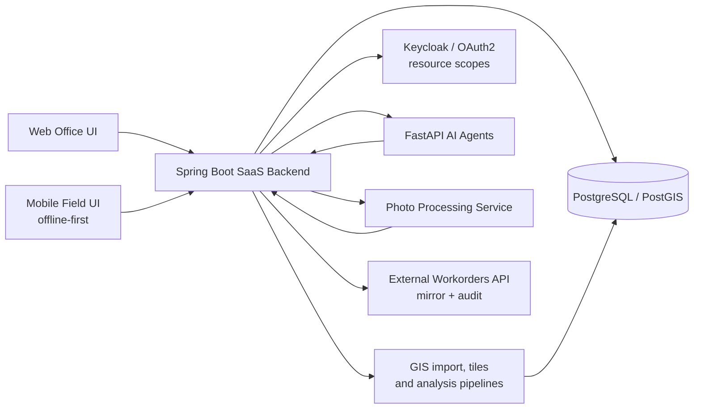

# Rabie Samadi - Backend, GIS & AI SaaS Portfolio

I build production SaaS platforms — backend, GIS, AI agents, and the security work that comes with real users and real clients.

This repo has sanitized write-ups of what I've shipped. No proprietary code, no client data, no production internals — just the architecture and the decisions behind it.

## Selected Case Studies

- [AppFibra - SaaS GIS, AI Agents & Enterprise Security](case-studies/appfibra-saas-gis-ai.md)
- [WilayaCenter Pharma - Pharmacy SaaS](case-studies/wilayacenter-pharma-saas.md)
- [Technical architecture diagrams](diagrams/appfibra-platform.md)
- [Talking points, the 60-second version](presentation/rabie-samadi-technical-portfolio.md)

## Core Strengths

- Backend: Java 17, Spring Boot, REST/SSE APIs, PostgreSQL, running in production.
- GIS: PostGIS, vector tiles, SHP imports, CRS/EPSG — built for field workflows, not just a map on a screen.
- AI agents on MCP: FastAPI, streaming, persistent history, and an actual feedback-to-eval loop instead of guessing whether a prompt change helped.
- Applied AI in real workflows: OCR for supplier documents, narrative payroll summaries, semantic product search over embeddings.
- Security: Spring Security, Keycloak/OAuth2, RBAC, CSRF/CORS, RLS, resource scopes, M2M auth between services.
- Multi-client GIS: configurable layers, per-client resolvers, precomputed KPIs, filtering pushed down to the backend.
- End-to-end delivery — requirements through architecture, implementation, deployment, and keeping it running afterward.

## Production Signals

- 2 production SaaS platforms, different verticals (FTTH infrastructure, pharmacy ERP/POS), both built and run solo.
- +200 municipalities, +200,000 homes covered by the FTTH platform's GIS/network data.
- 3 active industrial clients on the main platform.
- 50-100 concurrent users in day-to-day operational workflows.
- 3 internal services talking to each other through M2M authentication.
- Resource-level authorization down to project/city scope.

## Tech Stack

Java 17 · Spring Boot · Spring Security · Keycloak/OAuth2 · React · PostgreSQL · PostGIS · PostgresML · FastAPI · Python · Model Context Protocol (MCP) · Google Cloud Document AI · Google Gemini · MapLibre/Leaflet · Capacitor · SQLite · Power BI

## Architecture Snapshot

