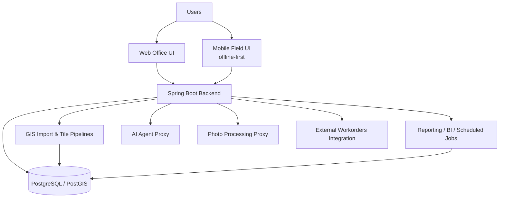
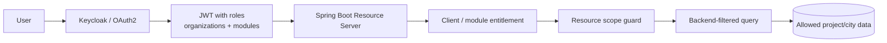
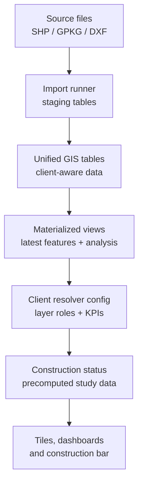

# AppFibra Architecture Notes

## Main Components

## Key Design Decisions

- GIS-first data model using PostgreSQL/PostGIS.
- Native SQL/JDBC for heavy GIS and reporting workloads.
- Batch/precomputed tables for expensive construction study data.
- Offline-first mobile workflows for field operations.
- Enterprise security controls around user sessions and internal services.
- Federated identity and resource-level authorization for project/city-scoped access.
- Multi-client GIS evolution through configurable layer roles and client-specific resolvers.
- Internal M2M token authentication between Java and Python services.
- Append-only audit design for external system synchronization.

## Security Themes

- RBAC by client and module.
- Keycloak/OAuth2 identity foundation.
- Resource scopes validated in the backend before list, export, audit, dashboard, and mutation operations.
- Tenant isolation with database-level controls.
- CSRF on user mutations.
- Restricted CORS in production.
- Session and user audit trails.
- Internal service authentication for backend-to-agent and backend-to-photo calls.

## Multi-Client GIS Pipeline

