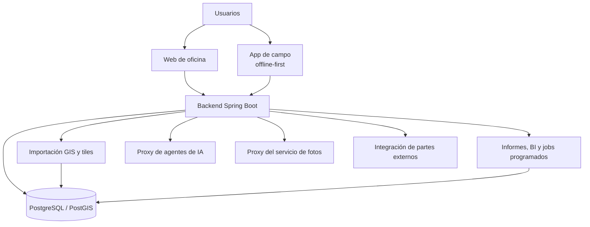
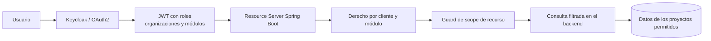
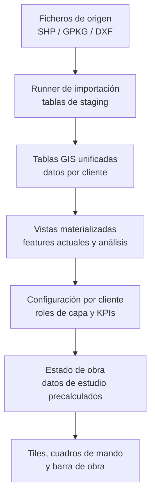

# Arquitectura de AppFibra

El mapa, no la historia. El razonamiento detrás de cada decisión concreta está en los [casos](../case-studies).

## Componentes principales

## Decisiones de diseño

- **Modelo de datos GIS de origen**, sobre PostgreSQL/PostGIS. No un esquema relacional al que se le añade geometría después.
- **JPA/Hibernate para el CRUD sencillo** (autenticación), y **SQL nativo con JDBC para GIS e informes**, donde un ORM esconde justo los planes de ejecución que hay que tunear.
- **Los números caros de estudio de obra se precalculan** en tablas por lotes, y no se calculan en cada petición: calcularlos al vuelo no aguanta los objetivos de usuarios concurrentes de la plataforma.
- **El trabajo de campo es offline-first.** Las cuadrillas trabajan donde la cobertura no es fiable, así que las escrituras se encolan en el dispositivo y se sincronizan cuando vuelve la conexión.
- **El GIS pasó de un cliente a tres sin reescritura**, porque los roles de capa y los resolvers son configurables por cliente y no están cableados al primero.
- **Los servicios Java y Python se autentican entre sí con tokens M2M.** Ni secretos compartidos, ni endpoints internos abiertos por confianza.
- **Lo que llega del sistema externo de partes es solo-altas y auditado**, así que un cambio hecho por un tercero aparece como una fila y no como una sobrescritura silenciosa.

## Seguridad

- **RBAC por cliente y por módulo**: un rol concedido sobre los datos de un cliente no se filtra a los de otro.
- **Identidad federada con Keycloak/OAuth2**, no una tabla de usuarios propia. El JWT lleva roles, organizaciones y módulos.
- **El scope de recurso se comprueba en el backend** antes de cada listado, export, auditoría, cuadro de mando y mutación. No se esconde solo en la interfaz.
- **Row-level security en Postgres** como segunda capa detrás de las comprobaciones del backend, no como sustituta de ellas.
- **CSRF en cada mutación**, y CORS cerrado en producción, no abierto por comodidad.
- **La sesión y las acciones de usuario se auditan**, así que "quién hizo esto" tiene respuesta.
- **Las llamadas del backend al agente y al servicio de fotos se autentican igual** que tendría que hacerlo un cliente externo: que algo sea interno no lo hace de confianza.

## Pipeline GIS multicliente

