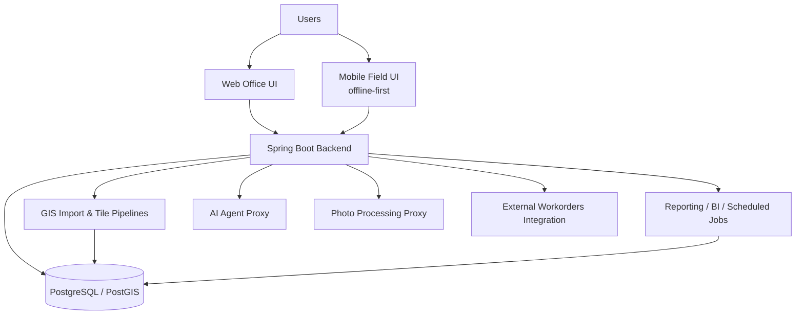
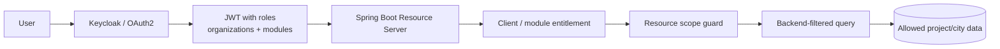
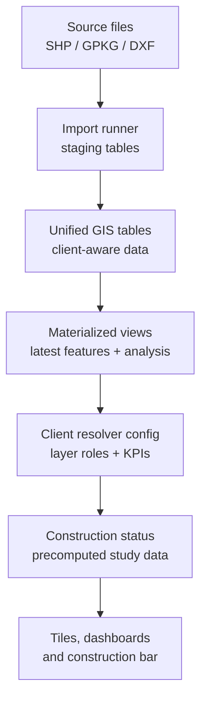

# AppFibra Architecture

The map, not the story — for the reasoning behind specific decisions, see the [case studies](../case-studies).

## Main Components

## Key Design Decisions

- GIS-first data model on PostgreSQL/PostGIS, not a relational schema with geometry bolted on afterward.
- JPA/Hibernate for simple CRUD entities (auth), native SQL/JDBC for GIS and reporting — where an ORM would hide the query plans that actually need tuning.
- Expensive construction-study numbers are precomputed into batch tables instead of calculated per request — computing them live doesn't hold up at the platform's concurrent-user targets.
- Mobile field workflows are offline-first: crews work where signal isn't reliable, so writes queue on the device and sync when connectivity comes back.
- The GIS layer went from one client to three without a rewrite, because layer roles and resolvers are configurable per client instead of hardcoded to one.
- Java and Python services authenticate to each other with M2M tokens — no shared secrets, no internal endpoint left open on trust.
- Data mirrored in from the external workorders system is append-only and audited, so a partner changing something shows up as a row, not a silent overwrite.

## Security

- RBAC scoped per client and module — a role granted in one client's data doesn't leak into another's.
- Identity federated through Keycloak/OAuth2 instead of a homegrown user table; JWTs carry roles, organizations and modules.
- Resource scope is checked in the backend before every list, export, audit, dashboard, and mutation — not just hidden in the UI.
- Row-level security in Postgres backs up the backend checks as a second layer, not a replacement for them.
- CSRF on every mutation; CORS locked down in production rather than left open for convenience.
- Session and user actions are audited, so "who did this" has an answer.
- Backend-to-agent and backend-to-photo-service calls authenticate the same way an external client would have to — internal doesn't mean trusted by default.

## Multi-Client GIS Pipeline

