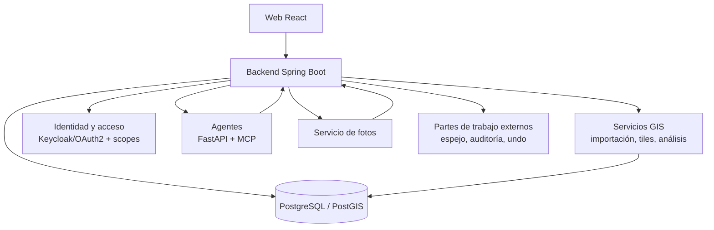

# AppFibra: SaaS GIS, agentes de IA y seguridad

> Write-up saneado: sin código propietario, sin credenciales y sin datos de cliente. Los identificadores están generalizados.

## Contexto

Plataforma SaaS para el despliegue de redes FTTH: GIS, operativa de campo, seguimiento de obra, informes, flujos documentales y análisis asistido por IA.

- **Cobertura**: +200 municipios, +200.000 homes, 3 clientes industriales.
- **Carga**: 50-100 usuarios concurrentes. El objetivo son 500.
- **Mi papel**: único desarrollador. Arquitectura, backend, frontend, modelo de datos, GIS, seguridad, despliegue y soporte en producción.
- **De dónde vienen los datos**: la mayoría de los registros entran por jobs ETL diarios que leen ficheros generados por sistemas de terceros. Lo que sale alimenta informes de cliente y facturación.

Las cifras de filas que aparecen más abajo son de cada dataset, no totales de la plataforma. Varias tablas cubren el mismo territorio (datos de red, contratos, activaciones), así que un número como 164.107 es el tamaño de una tabla importada.

## Origen del proyecto

La plataforma nació como proyecto personal. Por eso arriba pone *único desarrollador* y no *responsable de equipo*.

Antes de eso hubo un problema de datos. Un valor de longitud que se exportaba de la plataforma del cliente cambiaba al procesarlo geoespacialmente, y esa diferencia acababa en el cálculo del Bill of Material. Saqué la corrección a base de consultas SQL hasta dar con la fórmula que devolvía el valor al original, y la empaqueté en un plugin de Python con interfaz gráfica para que mis compañeros pudieran aplicarla sin tocar una query.

Después la empresa contrató desarrolladores para hacer la plataforma de seguimiento, y a mí me pusieron de enlace de datos. El proyecto se abandonó. El problema no era su nivel técnico: era el conocimiento del negocio. Necesitaban tanta información nuestra que el bucle de requisitos costaba más tiempo del que la herramienta ahorraba.

Lo que construí después empezó por el otro lado, por el dominio. Y creció a base de necesidades, no de elegir stack: primero Spring Boot con plantillas servidas, luego REST en cuanto metí tablas editables, y después la migración a React. Se lo enseñé a mi jefa y la empresa lo adoptó. Hoy lleva el control de fibra y producción, y alimenta otra aplicación de mantenimiento e instalaciones.

Write-ups relacionados: [rendimiento y capacidad](measured-performance.md), [pipeline de entrega](ci-pipeline-what-blocks.md) y [trampas conocidas](../trampas-conocidas.md).

---

## 1. Las importaciones diarias y la auditoría de cambios

La mayoría de los datos de la plataforma entran por importaciones automáticas que leen
ficheros generados por sistemas de terceros. Hay diecisiete registradas, repartidas entre los
tres clientes, cada una con sus datasets.

### Planificación y ejecución

El horario vive en una tabla, con la hora, la zona horaria y un interruptor de encendido por
job, y se edita desde el panel de administración. Un proceso comprueba cada minuto qué ha
vencido y lo lanza. Cambiar la hora de una importación es guardar un campo.

Las horas por defecto van escalonadas entre las 06:00 y las 09:00 para que las importaciones
no se pisen entre ellas ni con el uso de la mañana.

Cada job lleva un cerrojo en memoria dentro del proceso y un advisory lock de PostgreSQL
entre instancias. Dos servidores que arranquen la misma importación a la misma hora no la
duplican.

### Registro

Cada ejecución deja una fila con su estado, cuándo empezó, cuánto tardó, el mensaje y la clase
del error si falló. Y por debajo, cada fichero deja la suya: qué dataset, qué ruta, la fecha de
modificación del fichero de origen, si se importó y con qué resultado. Un fichero que ya consta
importado no se vuelve a procesar salvo que se fuerce.

El panel muestra una tarjeta por job y, al abrir una, la lista de sus ficheros con los fallos
arriba. La lista se pide aparte del listado de tarjetas, que se refresca solo, porque hay jobs
que superan los 280 ficheros.

Desde ahí también se lanza una importación a mano, con la opción de reimportar un fichero que
ya constaba hecho.

### Auditoría de cambios

Además del resultado de cada ejecución, las importaciones dejan un historial campo a campo:
qué columna de qué fila cambió, con el valor anterior y el nuevo.

Con eso se puede responder a un cliente que discute una cifra, con fecha y valor previo. Se
puede ver la línea temporal de una dirección cruzando datasets, porque la clave se normaliza a
una forma canónica común y el mismo home aparece aunque cada fichero de origen lo escriba
distinto. Y un tercero que reescribe media tabla aparece como un pico de cambios en una
ejecución concreta.

Las altas y las bajas guardan la fila entera en `jsonb`, así que un registro borrado se puede
volver a consultar tal y como estaba.

Qué cuenta como cambio lo decide el negocio, y esa regla está dentro del propio mecanismo. Las
columnas de fecha se comparan por día: un hito que pasa de las 16:10 a las 16:54 del mismo día
no entra en el historial. El resto de columnas se comparan por texto normalizado.

Dos límites de escritura:

- Una importación que trae la foto completa del origen se aborta si va a borrar más del 20% de
  una tabla con 100 filas o más.
- El historial es append-only: un cambio anotado no se puede editar ni borrar después, y lo
  impide la base de datos, no una comprobación en el código.

El historial de un home se consulta por un endpoint de administración, filtrable por dataset.

El mecanismo no depende del dataset: se declara qué tabla, qué clave y qué columnas son fechas.
Para un dataset sin clave única por fila la auditoría es por hash de contenido, y registra
altas y bajas en lugar de cambios de campo.

---

## 2. Seguridad: autenticación y autorización

### Autenticación

Identidad federada con Keycloak/OAuth2. El JWT llega con roles, organización y módulos, y se
convierte en autoridades en cada petición.

Los roles vienen de dos sitios. Los de cliente y módulo se leen de una tabla, que es su fuente
única, y se expanden a la misma cadena de authority que la aplicación ya usaba, así que cambiar
la fuente no obligó a tocar el código que comprueba permisos. Los globales se quedan en
Keycloak: los de romper el cristal, unos pocos funcionales transversales, y los que quedan por
migrar a roles de cliente y módulo. De esos, el converter solo acepta los de una lista blanca
explícita, para que un rol rancio o metido a mano en Keycloak no entre. Abajo llega la misma
cadena venga de donde venga.

Los servicios internos también se autentican entre sí: el backend Java y los dos servicios
Python se piden token, no se llaman a pelo por estar en la misma red.

Alrededor: política de contraseñas, control de intentos de acceso, limitación de peticiones,
CSRF en las mutaciones, CORS restringido en producción, registro de actividad de sesión y
resolución de IP de cliente para la auditoría.

### Autorización

La autorización decide, para cada usuario, a qué cliente entra, qué módulos ve, qué puede tocar
dentro de cada uno y sobre qué obras. Se combinan cuatro niveles:

- **Cliente.** Antes de leer nada, se comprueba que el usuario tiene acceso al cliente cuyos datos pide.
- **Módulo.** Tablas de Seguimiento, GIS, informes, agentes, facturación, documentación fotográfica.
- **Área dentro del módulo.** Cada tabla declara sus grupos de columnas y el permiso se concede por grupo (tipo de obra), así que se puede editar el bloque de una fase de obra y solo ver el resto de la fila. Hay además columnas técnicas que ningún rol edita, declaradas en el modelo de cada tabla.
- **Recurso.** El scope acota a proyectos concretos, o a ciudades según el cliente. Dos personas con el mismo rol ven filas distintas.

A una subcontrata se le asignan sus obras y ve la plataforma acotada a ellas: listados, cuadros
de mando, informes, exports y auditoría. El filtro se aplica en la consulta, no en la interfaz.

Todo se asigna desde la pantalla de administración. Publicar un informe o un agente nuevo es una
línea en su catálogo, y de ahí salen el permiso, la entrada de módulo y el chip de asignación.

Sobre el scope:

- Los niveles se ordenan: `view` < `edit` < `admin`, y un permiso concedido cubre los inferiores. Un valor que no se reconozca no cubre nada.
- Cada concesión admite fecha de fin, y a partir de ella deja de dar acceso por cualquier vía.
- Existe un scope de cliente que actúa de comodín y se comprueba antes que el recurso concreto, así que "todas las ciudades de este cliente" es una fila.

### Puntos de aplicación

- Un catálogo por familia como fuente única. Informes y agentes tienen el suyo y de él salen todos los derivados.
- Un punto de comprobación por familia (cliente, recurso, informe, agente) que se ejecuta antes de resolver la consulta. Un agente sin acceso se rechaza sin llamar al modelo.
- El scope entra en el SQL. No se filtra en memoria después de traer las filas.
- `/api/session` devuelve los módulos, vistas, informes, agentes y acciones del usuario, y la pantalla a la que entra. El frontend pinta eso y no deriva accesos por su cuenta, así que añadir una familia de roles es tocar un único mapa en el servidor.
- Row-level security en Postgres sobre las tablas multicliente. No cuenta hoy como segunda barrera: la política abre cuando la variable de sesión de cliente llega vacía, y esa vía está pendiente de cerrar.

---

## 3. Las tablas de seguimiento

Son la pantalla principal de trabajo de la oficina: rejillas de cientos de miles de filas y más de cuarenta columnas, editadas por varias personas a la vez, con el dato entrando por la importación diaria y saliendo hacia informes y facturación.

Un usuario puede filtrar, ordenar, agrupar, esconder y reordenar columnas, fijar las que quiere tener siempre delante, cambiar la densidad de las filas, pintar con formato condicional, editar en línea celda a celda o por lotes, analizar con una tabla dinámica, exportar, y abrir el historial de cualquier fila.

### Vistas guardadas

Toda esa configuración se guarda como una vista con nombre, y una vista guarda **todo** lo que define lo que ves: filtro global, filtros por columna, ordenación, columnas visibles, su orden, densidad, agrupación, reglas de formato condicional, columnas fijadas y numeración de filas. Con su versión de formato, para que una vista guardada hace meses siga abriéndose cuando el formato cambie.

El formato condicional viaja dentro de la vista. Si se quedara fuera, la vista restaurada no se parecería a la que se guardó.

### Barra de mando

En la barra queda visible lo que tiene estado: la agrupación activa y los filtros aplicados, con su aspa para retirarlos. El resto de comandos vive en el menú.

Paleta de comandos con `Ctrl+K`, que no sustituye al menú: en la paleta hay que escribir el nombre de la función, así que solo sirve si ya sabes que existe.

### Edición concurrente

- **Candados por celda, en tiempo real.** Al entrar en una celda se toma un candado que caduca en 25 segundos y se renueva mientras se está escribiendo. Quien la tenga cogida la ve marcada, y los demás saben que está ocupada antes de escribir en ella.
- **Un solo temporizador consulta quién tiene cogida cada celda**, en lugar de que cada cliente pregunte por su cuenta.
- **Bloqueo optimista al guardar.** El cliente manda la versión que creía tener; si no coincide, el servidor responde con la fila tal y como está ahora, no con un error genérico.
- **Un conflicto no tumba el resto del guardado.** Se aplica lo que está limpio y se devuelven los conflictos aparte, con la respuesta marcada como parcial.
- **Los permisos se comprueban fila a fila**, no por guardado. Lo que cae fuera del alcance del usuario vuelve identificado, sin cancelar lo demás.

### Reversión posterior al guardado

`Ctrl+Z` cubre lo que no ha salido del navegador. Lo de aquí es lo otro: un dato que ya han visto otros no se anula, se sobrescribe con el valor anterior.

Revertir es una escritura nueva, no una anulación: queda auditada con su autor y su hora, y pasa por el mismo bloqueo optimista que cualquier edición. El historial no se reescribe.

Tres formas:

- **Avisar antes.** Una edición masiva pide confirmación diciendo cuántas filas va a tocar.
- **Deshacer un cambio suelto** desde el historial de esa fila, para el error puntual.
- **Deshacer un guardado entero.** Cada guardado lleva un identificador propio, así que un lote de doscientas filas es una unidad, y el error masivo se corrige sin ir una por una.

Entre el guardado y el momento de revertirlo pasa tiempo, y las filas dejan de estar todas igual. La pantalla las reparte en tres grupos:

- **Las que nadie ha tocado desde entonces.** Se revierten directamente.
- **Las que otra persona ha modificado después.** Restaurar el valor anterior también borra lo que escribió esa persona, así que no se hacen solas: hay que pedirlo expresamente, sabiendo lo que se pisa.
- **Las que están fuera del alcance de quien revierte.** No se pueden escribir, y forzar no cambia nada, porque no es una cuestión de quién escribió el último sino de permisos.

Los dos últimos grupos se presentan separados: agrupados bajo una única categoría de error, el botón de forzar resolvería unas filas y otras no, sin explicación visible del resto.

El point-in-time recovery de la base de datos queda fuera de la aplicación: lo hace sistemas, no un usuario desde la pantalla.

### Cobertura

El historial y la reversión están sobre la tabla de seguimiento de un cliente, y pendientes de propagar al resto. Las piezas se escribieron con nombres neutros para que sirvan a cualquier tabla; dos rejillas anteriores conservan su propia copia con los nombres de su clave, y migrarlas cambiaría el JSON que ya consumen sus frontends.

No todas las tablas admiten lo mismo: las que se derivan de otra fuente son de solo lectura, y en las que no tienen columna de versión el guardado es el último que escribe. Está declarado en cada caso.

---

## 4. El GIS

La red se planifica y se construye sobre el mapa. Las geometrías viven en PostGIS y el visor del navegador es MapLibre.

### Ingesta

Los ficheros de proyecto llegan en SHP, GPKG y DXF. Se importan con GDAL a tablas de staging y de ahí a tablas unificadas por tipo de red, con los atributos guardados como `jsonb` a partir de la fila entera menos las columnas de geometría. Eso conserva atributos propios del origen, como la capa del DXF, sin declararlos uno a uno en el esquema.

Cada importación queda versionada, así que se puede saber de qué entrega viene cada geometría.

### Servicio de teselas

Dos caminos, según lo que se pinte:

- **Teselas vectoriales generadas al vuelo** desde PostGIS, con caché de servidor propia. La caché es independiente de la general de la aplicación, porque el tamaño compartido de esta se queda corto para teselas. Una tesela ya calculada se sirve sin volver a tocar la base de datos.
- **Archivos PMTiles generados por adelantado** para las capas de diseño de un proyecto. La cadena es PostGIS → GeoJSON por tipo de geometría en EPSG:4326 → GeoPackage → PMTiles con GDAL, y se sirven con soporte de rangos HTTP para que el visor pida solo el trozo que necesita.

El dato GIS cambia una vez al día, con el proceso nocturno, así que la caché tiene una vida larga y se invalida por proyecto cuando hay un recálculo de verdad. Las teselas salen con `ETag` y con cabeceras que permiten al proxy servirlas sin llegar a la aplicación; el `ETag` incluye la versión del proyecto, así que una regeneración las invalida sin purgar nada a mano.

### Indicadores de obra

Los indicadores de construcción no se calculan en cada petición: se precalculan en tablas de estudio. El recálculo pasa por una cola guardada en la base de datos, no en memoria:

- Las filas pendientes se reclaman con `FOR UPDATE SKIP LOCKED`, así que varias instancias pueden trabajar sobre la misma cola sin pisarse.
- Los trabajos que se quedan colgados demasiado tiempo se recuperan en el siguiente ciclo.
- Un nodo se puede configurar para no procesar cómputo, y solo servir.

Sobre esas tablas se apoya el análisis: resúmenes por proyecto, desglose por estado, transiciones entre entregas, y avisos cuando dos conjuntos no son comparables entre sí. Los metros de obra civil se calculan descontando los conductos paralelos, para no contar dos veces la misma zanja.

### Multicliente

Los roles de capa y los resolvers son configuración por cliente, y los KPIs de cada uno salen de su propia configuración. El GIS pasó de un cliente a tres sin reescritura.

Los usuarios pueden además añadir sus propias capas sobre el mapa, con sus metadatos.

---

## 5. Los agentes

Dos agentes de dominio responden preguntas de operación en lenguaje natural: cuántos homes hay
pasados en un municipio, qué contratos se cancelaron con la obra ya hecha, qué está listo para
activar. Uno tiene una superficie SQL restringida con control de admisión; el otro trabaja con
19 tools hechas a medida sobre Model Context Protocol.

Las tools no generan SQL. Envuelven las mismas vistas que leen los informes oficiales, así que
el agente y el informe semanal no pueden dar cifras distintas: hay una sola definición y no la
controla ninguno de los dos. Hay tools para resolver un proyecto por nombre, resumir hitos de
un proyecto o de la cartera entera, contratos por estado, la ficha de un home, lo que está
listo para la siguiente fase y detección de anomalías.

Toda tool de agregación devuelve la cifra acompañada de su cobertura: qué entró, qué quedó
fuera y por qué, la vista de la que sale el dato, y las advertencias que apliquen. Los listados
llevan un tope de filas y marcan cuándo el resultado se ha cortado.

El acceso al agente se asigna como cualquier otro permiso, y está acotado por dominio: quien
tiene el agente de un cliente no obtiene respuestas del otro. La comprobación se hace antes de
llamar al modelo. El JWT del usuario viaja hasta el servidor de tools, que aplica el mismo
control de scope por proyecto que la API REST, así que un usuario acotado a unas obras las ve
acotadas también preguntando.

La orquestación es Python con FastAPI y respuestas en streaming; el servidor de tools es Spring
Boot; los modelos se sirven por Amazon Bedrock. Hay un banco de evaluación con casos y un juez
automático para comprobar que un cambio en las tools o en el prompt no empeora respuestas que
antes salían bien.

[Write-up completo](mcp-agents-semantic-tools.md).

---

## 6. La documentación fotográfica

Los técnicos de obra fotografían las instalaciones de fibra y cada foto lleva una marca de agua con
la empresa, el pueblo, el nodo, la dirección y las coordenadas. Un microservicio en Python trata
esas fotos: lee la marca de agua, saca de ella las coordenadas y las escribe en el EXIF, o al revés,
resuelve la dirección contra Places y tablas de datos de equipo de obra y estampa la marca de agua corregida.
Después renombra los ficheros: cinco nomenclaturas distintas, una por cliente, tres de ellas
cruzando contra un Excel o un CSV de referencia.

[Write-up completo](photodoc-ocr-geocoding.md), con el OCR, el geocoding y el borrado del
rótulo en detalle.

---

## 7. Los partes de trabajo externos

Los partes de trabajo los lleva otra aplicación de la empresa, y la plataforma trabaja contra
ella en los dos sentidos. Hacia abajo mantiene un espejo local: cada sincronización baja todos
los partes paginados, con sus 59 columnas, los compara campo a campo contra el espejo y registra
altas, bajas y cambios en su propio historial, así que un cambio hecho por un tercero aparece
como una fila y no como una sobrescritura silenciosa. Los cambios que caen dentro de las doce
horas siguientes a una subida nuestra se atribuyen a esa subida, para no leerlos como movimiento
ajeno, y la misma pareja campo→valor repetida en cientos de partes se marca como cambio masivo.
Hacia arriba, la plataforma sube su tabla derivada, y antes de cada subida guarda una preimagen
del estado anterior junto a la entrada del historial de subidas, para poder deshacerla.

## Arquitectura

## Stack

Java 17 · Spring Boot · Spring Security · Keycloak/OAuth2 · React · PostgreSQL · PostGIS · FastAPI · Python · Model Context Protocol · MapLibre/Leaflet · Power BI
