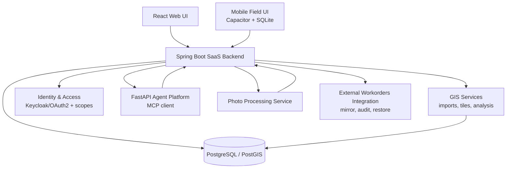

# AppFibra — SaaS GIS, AI Agents & Enterprise Security

> Sanitized: no proprietary code, credentials or client data. Identifiers generalized.

## Scope

Web/mobile SaaS platform for FTTH network deployment: GIS, field operations, construction follow-up, reporting, document workflows, AI-assisted analysis.

- Coverage: +200 municipalities, +200,000 homes, 3 industrial clients.
- Load: 50-100 concurrent users; target 500.
- Role: sole developer — architecture, backend, frontend, data model, GIS, security, deployment, production support.
- Data flow: most records arrive from daily ETL jobs over files produced by third-party systems. Outputs feed client reports and invoicing.

Five defects and design decisions are documented below. Performance work has separate write-ups: [Measured Performance Diagnosis](measured-performance-diagnosis.md) (browser) and [Capacity and Database Performance](capacity-and-database-performance.md) (server). Delivery pipeline: [CI With Security Built In](ci-pipeline-what-blocks.md).

---

## 1. ETL change audit reporting false modifications

**Problem.** The daily import maintained a change history used to attribute record modifications when a client disputed a figure. On a 164,107-row dataset it reported approximately 96,000 modified rows per run. Nearly all were false.

**Root cause.** In-memory string comparison between the incoming CSV and the stored rows. Date columns were stored as `2020-09-23 16:10:54` and delivered as `23/09/2020 16:10` — same instant, different representation. Every dated row was marked modified on every run.

**Fix.**

- Diff moved into the database. Each run loads the source file into `stg_<dataset>`, recreated `LIKE target` on every run so the comparison uses the target's real column types.
- Column-by-column comparison via `LATERAL VALUES`. The first implementation diffed `to_jsonb(row)`; a single mis-formatted date marks the entire row as changed and does not identify which field moved.
- Date columns compared by day, through a `to_date` wrapper accepting both `dd/MM` and ISO. Business rule: the date is significant, the time is not.
- Delete guardrail: a snapshot import aborts if it would delete more than 20 % of a target holding ≥100 rows.
- `INSERT`/`DELETE` retain a `jsonb` snapshot — stored, not compared.

**Result.** Production verification on the first migrated dataset: 164,107 rows processed, 0 changes reported. The mechanism is dataset-agnostic; remaining datasets are queued.

**Two defects found during the rebuild, unrelated to auditing:**

- A materialized view backing the follow-up screens was never refreshed. It held data, so nothing appeared broken, and a second view downstream inherited the staleness. Refresh is now chained in dependency order after the import that feeds it.
- One dataset has no unique key per row: two rows can share every identifying column. Inspection showed these are distinct jobs on the same order with different work types, not duplicates, so deduplication would delete valid records. That dataset is audited by content hash (`md5` over `to_jsonb` minus excluded columns): present in staging and absent from target is an insert, the inverse is a delete, and a field change registers as one of each.

---

## 2. Per-report authorization

**Requirement.** Grant report access individually — a user may hold the weekly report and not the activations report. Report count was growing per client.

**Design.** Reports modelled as a module, each report as an area within it, reusing the permission shape already used for column groups. A single catalog class maps client to report list. Derived from it: the authority name, the permission-model entry, the module entry, and the assignment chips in the admin UI. Adding a report is a one-line change to the catalog.

**Defect found during implementation.** The report identifier arrives as a request parameter and was resolved independently in three locations in the same controller: table selection, export filename, and a comparison endpoint. All three were individually correct. If any two diverge, the guard authorizes one report while the query serves another.

**Fix.** Single resolver, and a single `guardedTable(report)` method that resolves, calls the guard and returns the table. No code path reaches report data without passing the check. Endpoints that do not select a table by report identifier call the guard explicitly.

**Behaviour change.** Report access was previously inherited by any follow-up role. Removed: report access now requires an explicit grant. Applied at that point because the bulk of the user base had not yet been created and the migration cost was zero.

**Retained by decision.** Reports keep resource-scope filtering. The role determines which report, the scope determines how many projects.

---

## 3. Frontend re-deriving authorization

**Problem.** Route guards, navigation and landing logic in the React app each maintained their own hand-written union of role names. New role families were not added to those lists. Two failure modes resulted: users denied screens they were entitled to, and navigation links resolving to 403.

**Root cause.** A second implementation of an authorization rule the backend already computed correctly. The backend module map was complete throughout; only the frontend consumers had drifted.

Of the two failure modes, only the 403 is reported by users. A screen the user is entitled to and never sees produces no error and no ticket.

**Fix.** `/api/session` returns `allowedModules` and `allowedReports`. Route guards and the navigation catalog consume those directly instead of recomputing from `session.roles`. Adding a role family now requires editing one map on the server.

**Dead code removed in the same pass:** a landing-priority table superseded by a backend-provided landing path, and a navigation entry requiring a role family unrelated to the one its route enforced.

---

## 4. Undo over the change audit

**Feature.** The platform mirrors an external work-orders API with an append-only, field-level change log. Undo is built on that log: a single edit or a whole save can be reverted under optimistic locking.

The preview classifies affected rows into three groups: untouched since the edit, overwritten by another user in the interim, and outside the current user's scope. Force-overwriting the second group requires explicit confirmation.

**Defect found during implementation.** The audit did not record the first edit of each row — the write that creates its manual layer over imported data. Undo would return no result for any row edited exactly once, which is the highest-probability case for a revert request. The failure mode is silent: no error, no log entry, no failing test.

**Fix.** First edit recorded, so every row has a prior state to revert to.

---

## 5. Verification of the homes-passed definition

**Context.** "Homes passed" is derived from delivery status codes by a database function. The implementation was the only written definition; it had not been checked against the client's technical standard.

**Findings.**

- One code marked as homes-passed in the standard's own table is excluded by the function. The exclusion is correct — that column describes planning scope, not built infrastructure — but the reason was undocumented.
- One code is not homes-passed under the standard and is counted by the function. Impact: 10 homes in the active portfolio. Open pending a decision to exclude it.

**Outcome.** The counting logic was substantially correct. The change of state is that the definition now has a written source that is not the source code, recorded against the standard's section reference. All consumers, including the AI agent tools, call the same two functions, so a correction propagates from one place.

**Related, documented rather than fixed.** The field determining whether a home counts as invoiced is free text entered by hand. Parsing requires eight regular expressions and has two unresolvable classes of value: one non-parseable placeholder and one week-without-year format that cannot be assigned to a month. The canonical definition was narrowed to "field is present and non-empty".

---

## Platform capabilities

**GIS** — PostGIS model for network layers, vector tiles/MVT, SHP import pipelines with CRS/EPSG handling, MapLibre/Leaflet frontend workflows, precomputed construction-status tables, per-client configurable layer roles and resolvers, backend-side project filtering.

**AI agents** — domain agents over the Model Context Protocol exposing a semantic tool layer rather than text-to-SQL; tools wrap the same views the official reports read. Separate write-up: [Domain AI Agents on MCP](mcp-agents-semantic-tools.md).

**Security** — Spring Security over a Keycloak/OAuth2 foundation, resource scopes at project/city level, PostgreSQL RLS for tenant isolation, CSRF on mutations, restricted CORS in production, session auditing, internal M2M authentication between the Java backend and two Python services.

**Operations** — optimistic locking for concurrent grid editing, scheduled jobs with per-run tracking, operational dashboards over the import pipeline.

**Photo documentation** — OCR, geocoding and watermark removal over field photographs. Separate write-up: [Photo Documentation](photodoc-silent-failures.md).

## Architecture

## Tech stack

Java 17 · Spring Boot · Spring Security · Keycloak/OAuth2 · React · PostgreSQL · PostGIS · FastAPI · Python · Model Context Protocol · MapLibre/Leaflet · Capacitor · SQLite · Power BI
