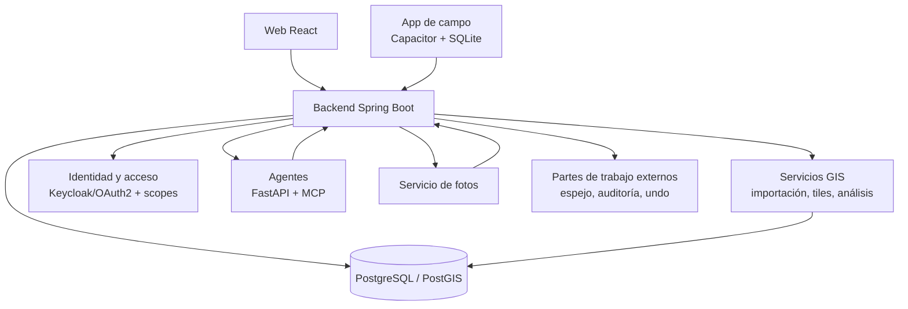

# AppFibra — SaaS GIS, agentes de IA y seguridad

> Write-up saneado: sin código propietario, sin credenciales y sin datos de cliente. Los identificadores están generalizados.

## De qué va

Plataforma SaaS web y móvil para el despliegue de redes FTTH: GIS, operativa de campo, seguimiento de obra, informes, flujos documentales y análisis asistido por IA.

- **Cobertura**: +200 municipios, +200.000 homes, 3 clientes industriales.
- **Carga**: 50-100 usuarios concurrentes. El objetivo son 500.
- **Mi papel**: único desarrollador. Arquitectura, backend, frontend, modelo de datos, GIS, seguridad, despliegue y soporte en producción.
- **De dónde vienen los datos**: la mayoría de los registros entran por jobs ETL diarios que leen ficheros generados por sistemas de terceros. Lo que sale alimenta informes de cliente y facturación.

Las cifras de filas que aparecen más abajo son de cada dataset, no totales de la plataforma. Varias tablas cubren el mismo territorio (datos de red, contratos, activaciones), así que un número como 164.107 es el tamaño de una tabla importada.

## Cómo empezó

La plataforma nació como proyecto personal. Por eso arriba pone *único desarrollador* y no *responsable de equipo*.

Antes de eso hubo un problema de datos. Un valor de longitud que se exportaba de la plataforma del cliente cambiaba al procesarlo geoespacialmente, y esa diferencia acababa en el cálculo del Bill of Material. Saqué la corrección a base de consultas SQL hasta dar con la fórmula que devolvía el valor al original, y la empaqueté en un plugin de Python con interfaz gráfica para que mis compañeros pudieran aplicarla sin tocar una query.

Después la empresa contrató desarrolladores para hacer la plataforma de seguimiento, y a mí me pusieron de enlace de datos. El proyecto se abandonó. El problema no era su nivel técnico: era el conocimiento del negocio. Necesitaban tanta información nuestra que el bucle de requisitos costaba más tiempo del que la herramienta ahorraba.

Lo que construí después empezó por el otro lado, por el dominio. Y creció a base de necesidades, no de elegir stack: primero Spring Boot con plantillas servidas, luego REST en cuanto metí tablas editables, y después la migración a React. Se lo enseñé a mi jefa y la empresa lo adoptó. Hoy lleva el control de fibra y producción, y alimenta otra aplicación de mantenimiento e instalaciones.

Debajo hay cinco defectos y decisiones. El trabajo de rendimiento tiene write-ups aparte: [navegador](measured-performance-diagnosis.md) y [servidor](capacity-and-database-performance.md). El pipeline de entrega, [aquí](ci-pipeline-what-blocks.md).

---

## 1. Una auditoría que reportaba cambios falsos

**El problema.** La importación diaria guardaba un historial de cambios, para poder decir quién tocó qué cuando un cliente discutía una cifra. Sobre un dataset de 164.107 filas reportaba unas 96.000 filas modificadas en cada ejecución. Casi todas falsas.

Un historial con ese ruido no es un historial malo: es un historial inútil. Nadie busca un cambio real entre 96.000 falsos.

**La causa.** Comparaba en memoria, como texto, el CSV que entraba contra las filas guardadas. Las fechas estaban almacenadas como `2020-09-23 16:10:54` y llegaban como `23/09/2020 16:10`. Mismo instante, distinta representación. Cada fila con fecha salía modificada todos los días.

**Lo que hice.**

- **Moví el diff a la base de datos.** Cada ejecución carga el fichero en una tabla de staging creada `LIKE` la tabla destino, así que la comparación usa los tipos reales de las columnas. Comparando fecha contra fecha, el formato deja de existir como problema.
- **Columna a columna, con `LATERAL VALUES`.** El primer intento comparaba `to_jsonb(row)`, que es más elegante y está mal por dos motivos: una sola fecha mal formateada marca la fila entera, y encima no te dice qué campo se movió, que es para lo que existe el historial.
- **Las fechas se comparan por día.** Esto no es una decisión técnica, es una regla de negocio: aquí la fecha cuenta y la hora no. Si un hito pasa de las 16:10 a las 16:54 del mismo día, para el seguimiento de obra no ha cambiado nada.
- **Freno de borrado.** Una importación de tipo snapshot se aborta si va a borrar más del 20% de una tabla con 100 filas o más. Un fichero que llega truncado es algo que pasa; vaciar media tabla porque el fichero venía cortado, no.
- **Las altas y bajas guardan un snapshot `jsonb`.** Ahí sí vale: se guarda, no se compara.

**El resultado.** Verificado en producción sobre el primer dataset migrado: 164.107 filas procesadas, **0 cambios reportados**. El mecanismo no depende del dataset; el resto están en cola.

**Y de paso aparecieron dos cosas que no tenían que ver con la auditoría:**

Una vista materializada de la que leen las pantallas de seguimiento **no se refrescaba nunca**. Tenía datos, así que nada parecía roto. Solo estaban viejos, y una segunda vista que leía de ella heredaba el desfase. Ahora se refresca encadenada, en orden de dependencia, después de la importación que la alimenta.

Y un dataset no tiene clave única por fila: dos filas pueden compartir todas las columnas que identifican. Lo normal sería deduplicar. Al mirarlas resultó que eran trabajos distintos sobre el mismo pedido, con tipos de trabajo diferentes, así que deduplicar habría borrado registros válidos para que el algoritmo estuviera cómodo. Ese se audita por hash de contenido: `md5` sobre el `to_jsonb` de la fila menos las columnas excluidas. Si está en staging y no en destino es un alta, al revés una baja, y un cambio de campo aparece como las dos cosas. Es menos preciso y no miente.

---

## 2. Permisos por informe

**Lo que pedía el negocio.** Poder dar acceso a un informe sí y a otro no: este usuario ve el semanal pero no el de activaciones. Y los informes crecían, varios por cliente.

**El diseño.** Los informes son un módulo y cada informe un área dentro de él, reutilizando la forma de permiso que la plataforma ya usaba para los grupos de columnas. Un único catálogo mapea cliente → lista de informes, y de ahí salen solos el nombre de la authority, la entrada del modelo de permisos, la del módulo y los chips de la pantalla de asignación. **Añadir un informe es una línea.**

**El fallo que encontré escribiéndolo.** El identificador del informe llega como parámetro de la petición, y se estaba resolviendo por separado en tres sitios del mismo controller: para elegir la tabla, para el nombre del export y en un endpoint de comparación. Los tres eran correctos.

Pero tres interpretaciones de una misma entrada es un bypass esperando una errata: en cuanto dos discrepan, el guard autoriza un informe y la query sirve otro. Ahora resuelve un único sitio, y hay un solo método que resuelve, llama al guard y devuelve la tabla. No queda camino que llegue a los datos sin pasar el control.

**Un cambio de comportamiento a propósito.** Antes, tener cualquier rol de seguimiento te daba los informes por herencia. Lo quité: ahora hay que concederlos explícitamente. Lo hice en ese momento justamente porque el grueso de los usuarios todavía no estaba creado y migrar costaba cero. Seis meses después habría sido una semana de soporte.

**Lo que mantuve.** Los informes siguen filtrando por scope. El rol decide qué informe, el scope cuántos proyectos.

---

## 3. El frontend recalculaba permisos que el backend ya sabía

**El problema.** Los guards de ruta, la navegación y la lógica de aterrizaje mantenían cada uno su propia unión de nombres de rol, escrita a mano. Cuando aparecía una familia de roles nueva, esas listas no se actualizaban. Y fallaba en las dos direcciones: usuarios a los que se les negaban pantallas que sí les tocaban, y enlaces de menú que llevaban a un 403.

**La causa.** Había una segunda implementación de una regla que el backend ya calculaba bien. El mapa de módulos del servidor estuvo correcto todo el tiempo; los que se habían desviado eran los consumidores del frontend.

De los dos fallos, **solo el 403 lo reporta alguien**. Una pantalla que te corresponde y nunca ves no genera error, ni ticket, ni rastro. Parece simplemente que esa función no se hizo para ti.

**La solución.** `/api/session` devuelve `allowedModules` y `allowedReports`, y el frontend pinta eso y no lo recalcula desde `session.roles`. Añadir una familia de roles hoy es tocar un único mapa en el servidor.

De paso cayó código muerto: una tabla de prioridad de aterrizaje que ya sustituía un dato del backend, y una entrada de navegación que pedía una familia de roles distinta de la que exigía su propia ruta.

---

## 4. El undo, y la edición que nunca se registró

**Qué es.** La plataforma mantiene un espejo de una API externa de partes de trabajo, con un log de cambios campo a campo en el que solo se añade. El undo se apoya en ese log: se puede revertir una edición suelta o un guardado entero, con bloqueo optimista.

La vista previa separa las filas en tres grupos: las que nadie ha tocado desde entonces, las que otro usuario ha sobrescrito mientras tanto, y las que quedan fuera del scope del que revierte. Pisar el segundo grupo exige una confirmación explícita, porque estás descartando trabajo de otra persona.

**Lo que encontré construyéndolo.** La auditoría **no registraba la primera edición de cada fila**: la que crea su capa manual sobre el dato importado.

O sea que el undo no habría devuelto nada justo para las filas editadas una sola vez, que son las que con más probabilidad quieres revertir. Y no habría fallado: ni error, ni línea en el log, ni test en rojo. Un botón que no hace nada.

**El arreglo.** Registrar también la primera edición, para que toda fila tenga un estado anterior al que volver.

---

## 5. Verificar un número en vez de fiarse del código

**El contexto.** "Homes passed" es la cifra sobre la que gira este negocio, y la calcula una función de base de datos a partir de códigos de estado. Esa implementación era la única definición escrita que existía, y nadie la había contrastado con la normativa técnica del cliente.

**Lo que salió.** La cuenta estaba bien en lo esencial. Dos cosas no.

- Un código que la propia tabla de la normativa marca como homes passed está excluido por la función. La exclusión es correcta (esa columna describe alcance de planificación, no infraestructura construida), pero el motivo no estaba escrito en ningún sitio.
- Otro código que la normativa **no** cuenta como homes passed sí lo contaba la función. Impacto: 10 homes de la cartera activa. Pendiente de decidir si se excluye.

**Lo que cambió.** Sobre todo, que el número ya tiene una fuente escrita que no es el código fuente, referenciada contra el apartado de la normativa. Todos los que consumen esa cifra, incluidas las tools del agente de IA, llaman a las mismas dos funciones, así que una corrección se propaga desde un solo sitio.

**Algo relacionado, que documenté sin arreglarlo.** El campo que decide si un home cuenta como facturado es texto libre que se rellena a mano. Parsearlo pide ocho expresiones regulares y hay dos tipos de valor que no se pueden resolver: un marcador que no es parseable, y un formato de semana sin año que no se puede asignar a ningún mes. La definición canónica se redujo a "el campo está y no está vacío". Un parser no puede recuperar información que la entrada nunca tuvo.

---

## Qué más hay en la plataforma

Esto son capacidades. Las decisiones están arriba.

**GIS.** Modelo PostGIS para las capas de red, vector tiles/MVT, importación de SHP con manejo de CRS/EPSG, mapas con MapLibre/Leaflet, tablas de estado de obra precalculadas, roles de capa y resolvers configurables por cliente, y filtrado por proyecto en el backend.

**Agentes de IA.** Agentes de dominio sobre Model Context Protocol, con una capa de tools semánticas y no text-to-SQL; las tools envuelven las mismas vistas que leen los informes oficiales. [Write-up aparte](mcp-agents-semantic-tools.md).

**Seguridad.** Spring Security sobre Keycloak/OAuth2, scopes de recurso a nivel de proyecto o ciudad, RLS de PostgreSQL para aislar clientes, CSRF en las mutaciones, CORS restringido en producción, auditoría de sesión y autenticación M2M entre el backend Java y dos servicios Python.

**Operación.** Bloqueo optimista para edición concurrente de tablas, jobs programados con seguimiento por ejecución, y paneles de operación sobre el pipeline de importación.

**Documentación fotográfica.** OCR, geocoding y borrado de marcas de agua sobre fotos de campo, donde lo que se entrega al cliente *es* la foto. [Write-up aparte](photodoc-silent-failures.md).

## Arquitectura

## Stack

Java 17 · Spring Boot · Spring Security · Keycloak/OAuth2 · React · PostgreSQL · PostGIS · FastAPI · Python · Model Context Protocol · MapLibre/Leaflet · Capacitor · SQLite · Power BI
