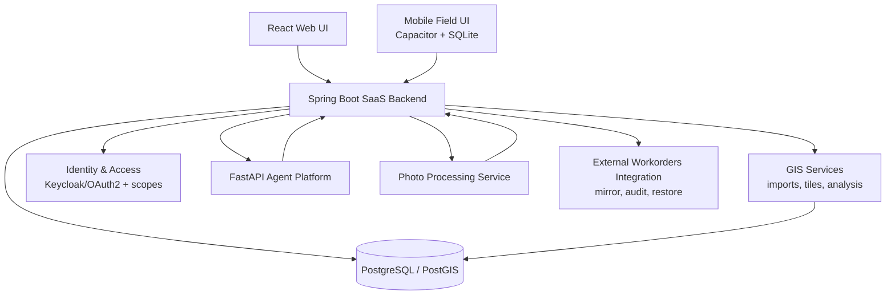

# AppFibra - SaaS GIS, AI Agents & Enterprise Security

> Sanitized write-up — no proprietary code, credentials, or client data, just the architecture and the decisions behind it.

## Overview

AppFibra is a web/mobile SaaS platform for FTTH network deployment, field operations, GIS analysis, construction follow-up, reporting, document workflows, and AI-assisted operations.

The platform supports:

- +200 municipalities
- +200,000 homes
- 3 active industrial clients
- Web office workflows
- Mobile/offline-first workflows for field technicians

## Role & Ownership

Built and operate AppFibra as the sole developer, end-to-end:

- Requirements analysis translated directly into architecture and implementation.
- Backend, frontend, data, GIS, security, and automation — all layers, solo.
- Deployment, production support, and iteration based on real field usage.
- Technical documentation to keep the system maintainable as a single developer.

## Technical Scope

### Backend & SaaS

- Java 17 and Spring Boot.
- REST and SSE APIs.
- PostgreSQL and PostGIS.
- Multi-client architecture.
- Optimistic locking for concurrent table editing.
- Audit logging and operational dashboards.
- Batch jobs and scheduled refreshes.

### GIS & Spatial Data

- PostGIS spatial model for FTTH network layers.
- Vector tiles / MVT services.
- MapLibre / Leaflet frontend map workflows.
- SHP import pipelines.
- CRS/EPSG handling.
- Precomputed construction status and study tables.
- Advanced filtering across GIS, contracts, activations, and network data.
- Multi-client GIS migration with configurable layer roles, client-specific resolvers, separated KPIs, and backend-side project filtering.
- Active-layer comparison for construction metrics: selected map layers drive HLD/LLD/ASBUILT comparisons, with safe fallback to client configuration.

### AI Agents

- FastAPI agent service.
- Domain-specific LLM agents built on the Model Context Protocol (MCP), exposing a semantic tool layer rather than raw text-to-SQL access.
- Orchestration layer.
- Streaming SSE responses.
- Persistent conversation history.
- Tool validation and result truncation.
- Feedback-to-eval pipeline for regression detection.

### Enterprise Security

- Spring Security.
- Keycloak/OAuth2 identity foundation.
- RBAC by client and module.
- Resource-level authorization for project/city-scoped access.
- CSRF protection for user mutations.
- Restricted CORS in production.
- BCrypt password hashing.
- Session auditing.
- PostgreSQL RLS / tenant isolation.
- Internal M2M authentication with `X-AppFibra-Internal-Token`.

### Identity & Resource Authorization

The platform evolved from module-level permissions toward resource-level authorization:

- Federated identity model with organizations, modules, and roles.
- JWT-based authentication through OAuth2 Resource Server.
- Resource scopes for project/city-level access control.
- Backend-side filtering for lists, dashboards, exports, audit data, and batch operations.
- Admin UI for assigning and removing resource scopes without manual SQL.
- Legacy session compatibility during migration, with a planned path toward Keycloak-only authentication.
- Authorization is consolidating onto a single plane. Role and grant data used to be scattered across identity-provider roles; now it lives in one internal source of truth, expanded into request-time authorities with caching. A small allowlist of legacy global roles stays around for backward compatibility during the migration, but downstream guard logic doesn't need to know the difference — it gets the same authority shape either way.

### M2M Architecture

Internal services authenticate with a shared internal token:

- Spring Boot backend.
- Python AI agent service.
- Python photo-processing microservice.

FastAPI services reject protected requests without a valid token, while Java and Python clients propagate the header when calling internal APIs.

### External Integration & Audit

Integration with an external workorders API includes:

- Local mirror of remote workorders.
- Append-only change audit.
- Field-by-field diffing.
- Native audit event ingestion.
- Mass anomaly detection.
- Historical reconstruction.
- Restore-preview and corrective export workflows.

User-facing undo sits on top of the same audit trail: a single edit or a whole save can be reverted, under optimistic locking, with a preview that separates the rows nobody has touched from the ones someone overwrote in the meantime and the ones outside the user's scope. Force-overwriting the second group takes an explicit confirmation, because it discards somebody else's work.

Writing it surfaced a gap worth mentioning: the audit wasn't recording the *first* edit of each row — the one that creates its manual layer. Undo would have been impossible for exactly the rows most likely to need it, and nothing about the feature would have looked broken until someone tried.

## Selected Impact

- The old import-audit system flagged tens of thousands of false changes a day, just from a date-format mismatch between two data sources. Replaced it with a field-level audit, verified in production with zero false positives — the team can actually trust the change history now when a client disputes something.
- Redesigned the permission model so adding a new report is a one-line config change, not a security deployment. Also made sure hundreds of existing users wouldn't quietly inherit access to it by accident.
- Checked the "homes passed" counting logic against the client's official technical standard and fixed a discrepancy that was slightly overstating the numbers we reported to the business.
- Answered "how many concurrent users does this take" with a load test instead of an estimate — knee measured between 150 and 300 concurrent users at 187 req/s — and used it to size the production machine. [Write-up](capacity-and-database-performance.md).
- Enabled GIS-first workflows across office and field teams.
- Hardened internal service-to-service communication across Java and Python services.

## Architecture Summary

## Tech Stack

Java 17 · Spring Boot · Spring Security · Keycloak/OAuth2 · React · PostgreSQL · PostGIS · FastAPI · Python · MapLibre/Leaflet · Capacitor · SQLite · Power BI
