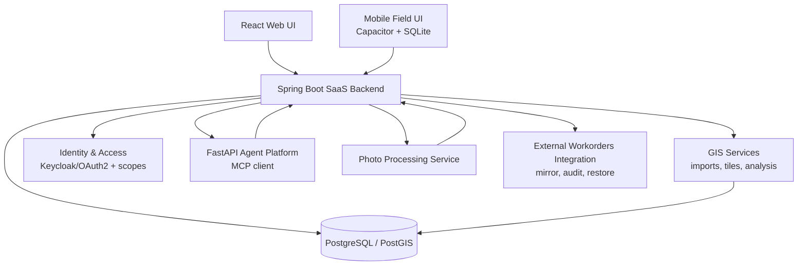

# AppFibra — SaaS GIS, AI Agents & Enterprise Security

> Sanitized write-up — no proprietary code, credentials, or client data. This one is about decisions: four places where the obvious fix was the wrong one, and what the right one cost.

## The short version

A web/mobile SaaS platform for FTTH deployment — GIS, field operations, construction follow-up, reporting, and AI-assisted analysis — covering +200 municipalities and +200,000 homes for 3 industrial clients, with 50-100 concurrent users. Built and operated solo, end-to-end.

The four decisions below are the ones worth reading. Each had a cheaper answer that would have looked like it worked.

## Context

The platform tracks the physical build-out of a fibre network: which homes are passed, which are contracted, which are activated, what civil works are pending, and who did what to which record. Most of its data arrives from daily ETL jobs over files produced by other systems, and most of its users are looking at a number that somebody downstream will put in a report or an invoice.

That shapes everything here. When the source of a number is a file from another system and the consumer is a client's invoice, "roughly right" is not a category that exists.

---

## 1. An audit that reported 96,000 false changes a day

The daily import kept a change history so the team could answer *who changed this, and when* when a client disputed a figure. It compared the incoming file against the stored rows in memory, as strings, and on a 164,107-row dataset it reported around **96,000 modified rows every day**.

Almost none of them were real. The dates were stored as `2020-09-23 16:10:54` and arrived as `23/09/2020 16:10`. Same instant, different text.

The tempting fix is a normalization pass before comparing. It would have removed the noise and left the real defect intact, because the noise was a symptom of something else: **there was no definition anywhere of what "changed" means.** String equality was standing in for one.

What replaced it:

- **The diff moved into the database.** Each run loads the file into a staging table created `LIKE` the target, so the comparison happens between the real column types rather than between whatever the loader produced.
- **Column by column, not whole-row JSON.** The first attempt diffed `to_jsonb(row)`, which is elegant and wrong for exactly the reason above — one badly-formatted date marks the entire row as changed and tells you nothing about which field moved.
- **Date columns compare by day.** That is a business rule, not a technical one: for these datasets the date counts and the time doesn't, so an import that only shifts the hour is not a change anybody wants in a history.
- **A delete guardrail.** A snapshot import that would remove more than 20 % of a non-trivial target aborts the run instead. A truncated source file is a normal Tuesday; silently emptying a table because of one is not.

Verified in production on the first migrated dataset: 164,107 rows in, **0 changes reported** — down from ~96,000. The mechanism is generic, and the remaining datasets are queued behind it.

**Two things the rebuild uncovered that had nothing to do with auditing.**

A materialized view the follow-up screens read from **was never being refreshed**. Nothing looked broken — it had data, it was just old, and a second view downstream inherited the staleness. It now refreshes as part of the same chain, in dependency order.

And one dataset has no unique key per row: two rows can share every identifying column. The reflex is to deduplicate. Looking at them showed they were **genuinely different jobs** on the same order — different work types — and deduplicating would have destroyed real records to make a diff algorithm happy. That dataset is audited by content hash instead: present in the file and not in the table is an insert, the reverse is a delete, and a field change shows up as one of each. Less precise, and it doesn't lie.

**The lesson worth carrying:** false positives in an audit aren't noise to filter out. They're the audit telling you it doesn't know what a change is.

---

## 2. Adding a report should not be a security deployment

Reports were growing — one per client, then several per client — and the business asked for something reasonable: this user sees the weekly report, but not the activations report.

The straightforward implementation is a permission check per report plus a list somewhere of who gets which. It works until the fourth report, at which point the list lives in three files and one of them is stale.

Instead, reports became **a module, and each report an area inside it**, reusing a permission shape the platform already had for column groups elsewhere. A single catalog maps client to reports; the authority name, the permission-model entry, the module entry and the chips in the admin UI are all derived from it. **Adding a report is one line**, and the screen that assigns permissions needs no changes to know the new report exists.

The interesting part came out of writing it. The report identifier arrives as a query parameter from the browser, and it was being interpreted in **three separate places** in the same controller — once to pick the table, once to name the export, once for a comparison endpoint. Each interpretation was correct. Nothing was broken.

But three interpretations of one input is a bypass waiting for a typo: the moment two disagree, the guard authorizes one report while the query serves another. It now resolves in exactly one place, and a single method resolves, checks and returns the table — so there is no code path that reaches a report's data without passing the check.

**One deliberate breaking change.** Report access used to be inherited by anyone holding any follow-up role. That was convenient, and it meant every new report would be quietly visible to hundreds of users on the day it shipped. It was removed: nobody has reports until granted them explicitly. That was done *at that moment* precisely because the bulk of the user base hadn't been created yet and the migration cost was zero. The same change six months later is a support week.

---

## 3. The frontend was re-deriving permissions the backend already knew

Navigation and route guards in the React app decided what to show by combining role names **by hand**, once per consumer — one list in the nav, another in the route guard, another in the landing logic.

Every time a new family of roles appeared, those lists didn't move. The result drifted in both directions: users denied screens they had every right to see, and menu links that led straight to a 403.

The backend had never drifted. Its module map was complete and correct the whole time. There was simply a second implementation of the same rule in the frontend — and a second implementation of a rule is one rule and one bug.

The fix isn't clever: the session endpoint returns the modules and reports the user actually has, and the frontend renders that instead of recomputing it. What makes it worth writing down is which half of the failure gets noticed. **The 403 is the harmless direction.** It's visible, someone reports it, it gets fixed. The other direction — a screen the user should have and never sees — produces no error, no ticket and no evidence. It just looks like the feature was never built for them.

Adding a role family now touches one map on the server. If a hand-written role union shows up in the frontend again, it's a bug that simply hasn't happened yet.

---

## 4. Undo, and the edit that was never recorded

The platform mirrors an external work-orders API and keeps an append-only, field-level change log over it. That log made user-facing undo possible: a single edit or a whole save can be reverted under optimistic locking, with a preview that separates the rows nobody has touched since, the rows somebody else overwrote in the meantime, and the rows outside the user's scope. Force-overwriting the second group takes an explicit confirmation, because it discards someone else's work.

Building it surfaced the part actually worth reporting: **the audit was not recording the first edit of each row** — the one that creates its manual layer over the imported data.

So undo would have failed for exactly the rows most likely to need it: the ones edited once, by someone who realized a second later they'd edited the wrong record. And nothing would have looked broken. No error, no red log line, no failing test — just an undo button that did nothing, in the one case where it mattered.

The feature was fine. Its foundation had a hole in it, and only building something that leaned on the foundation revealed it.

---

## 5. A smaller one: verifying a number instead of trusting the code

"Homes passed" is the figure this business runs on, and it was being produced by a function nobody had checked against the client's official technical standard — the code *was* the definition, because it was the only written one.

Reading the standard against the implementation: the counting was substantially correct. Two things weren't.

- One status code is marked as homes-passed in the standard's own table and shouldn't be counted — that column describes planning scope, not built infrastructure. The code already excluded it, correctly, for a reason nobody had written down.
- One code is *not* homes-passed in the standard, and the code counted it anyway. Small — ten homes — and real.

The outcome was mostly "the code was right", which is a dull result and exactly why it's worth reporting: the value wasn't the fix, it was that the number now has a written source that isn't the source code. Every consumer of it, the AI agents included, calls the same two functions, so a correction propagates everywhere at once instead of reaching whichever query someone remembers to update.

A related definition — the one deciding whether a home counts as invoiced — turned out to rest on a **free-text field filled in by hand**, needing eight regular expressions to parse, with two values that can't be resolved at all. That one is documented rather than fixed, because a parser cannot recover information the input never carried.

---

## What else is in the platform

Compressed deliberately. These are capabilities; the decisions are above.

**GIS** — PostGIS model for the network layers, vector tiles, SHP import pipelines with CRS/EPSG handling, MapLibre/Leaflet workflows, precomputed construction-status tables, and configurable per-client layer roles so that a second client is configuration rather than a fork.

**AI agents** — domain agents over the **Model Context Protocol**, exposing a semantic tool layer instead of text-to-SQL, so the agent and the official report resolve to the same definition and cannot disagree. It has its own write-up: [Domain AI Agents on MCP](mcp-agents-semantic-tools.md).

**Security** — Spring Security on a Keycloak/OAuth2 foundation, resource-level scopes down to project/city, RLS for tenant isolation, CSRF on mutations, restricted CORS, session auditing, and internal M2M authentication between the Java backend and two Python services.

**Operations** — optimistic locking for concurrent grid editing, scheduled jobs with per-run tracking, and operational dashboards over the import pipeline.

**Photo documentation** — OCR, geocoding and watermark removal over field photographs, where the deliverable handed to the client *is* the photo. Its own write-up: [A Pipeline Where Nothing Fails Loudly](photodoc-silent-failures.md).

The browser and database performance work on this platform has its own write-ups: [Measured Performance Diagnosis](measured-performance-diagnosis.md) and [Capacity and Database Performance](capacity-and-database-performance.md). The delivery pipeline is in [CI With Security Built In](ci-pipeline-what-blocks.md).

## Architecture

## Takeaway

Four fixes, four cheaper alternatives that would have shipped: normalize the strings, add another permission check, patch the role list, ignore an undo button that quietly does nothing.

What they share is that the cheap version leaves no evidence when it's wrong. **The work was making each of them fail loudly instead.**

## Tech Stack

Java 17 · Spring Boot · Spring Security · Keycloak/OAuth2 · React · PostgreSQL · PostGIS · FastAPI · Python · Model Context Protocol · MapLibre/Leaflet · Capacitor · SQLite · Power BI
