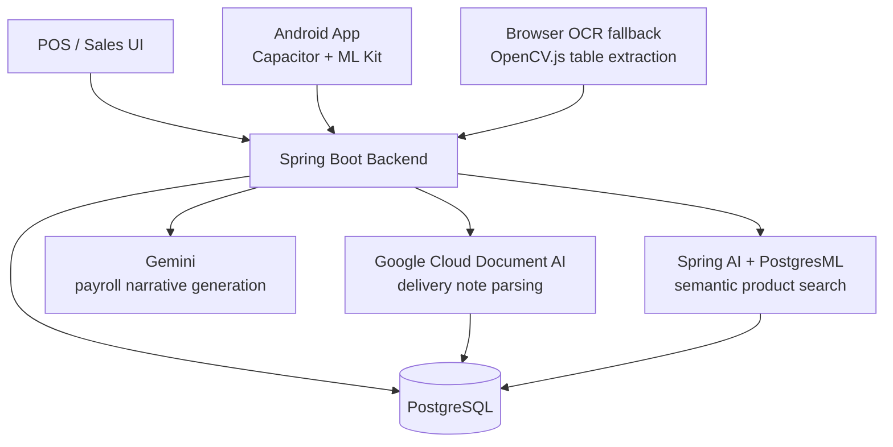

# WilayaCenter Pharma - Pharmacy ERP/POS SaaS with Applied AI

> Sanitized write-up — no private customer data, credentials, or production internals.

## Overview

WilayaCenter Pharma is a full ERP/POS SaaS platform for pharmacy operations, deployed with real users in Morocco. Beyond point-of-sale, the platform covers the full operational loop of a pharmacy business:

- Sales (POS) with FEFO lot management.
- Purchasing, including AI-assisted parsing of supplier delivery notes.
- Inventory, pricing, and supplier/quote management.
- Accounting: expenses, tax (TVA) declarations, and payroll.
- Staff attendance and on-call/guard shift scheduling.
- Barcode scanning and Android distribution through Capacitor.

## Role & Ownership

Owned the whole thing solo: product design, backend and frontend, data modeling, AI features, deployment, support.

## Technical Scope

### Backend

- Java 17, Spring Boot 3.5.
- REST APIs across sales, inventory, purchasing, pricing, suppliers, accounting, and attendance domains.
- PostgreSQL persistence, mixing plain JDBC and JPA depending on the module.
- MapStruct for DTO mapping, Lombok, and Testcontainers-based integration tests against a real PostgreSQL instance.
- Business rules for lot expiration and FEFO (First-Expire-First-Out) workflows across sales, inventory, and purchasing.

### Applied AI - Purchasing & Document Intelligence

- Google Cloud Document AI integration to parse supplier delivery notes (albaranes) from scanned documents or photos.
- Dual extraction strategy: structured entity extraction first, with a fallback parser that reads raw detected tables when entities are unavailable or low-confidence.
- Robust normalization layer: multi-locale numeric parsing (FR/ES/DE/US formats), automatic discount reconciliation between unit price, quantity, and line totals, and date parsing across multiple formats.
- Client-side computer vision fallback using OpenCV.js in the browser for table extraction from scanned images, reducing dependency on the cloud OCR step for simpler documents.

### Applied AI - Search & Operations

- Semantic product search powered by Spring AI with PostgresML-backed embeddings, exposed as a natural-language search endpoint over the product catalog.
- LLM-generated narrative summaries (Google Gemini) for payroll/HR review: structured attendance and overtime data is turned into a short natural-language summary for managers, flagging balances that need attention.

### Sales, Inventory & Pricing

- POS sales workflow with ticketing and lot-aware stock deduction.
- Barcode scanning on mobile (Capacitor + ML Kit) integrated with fast single/bulk product resolution.
- Rule-based pricing engine and supplier quote management feeding purchasing decisions.

### Accounting, Payroll & Attendance

- Expense tracking and TVA (tax) declaration workflows.
- Payroll calculation including overtime and on-call/guard-shift hours, with AI-generated narrative summaries per employee and per team.
- Staff attendance tracking with automated weekly close jobs and a public-facing on-call pharmacy status page.

### Frontend & Mobile

- React frontend (Mantine UI, TanStack Query) covering sales, inventory, purchasing, accounting, and admin screens designed for repeated daily use.
- Capacitor Android packaging with native barcode scanning and camera capture for document intake.

## Selected Impact

- Built a complete ERP/POS SaaS product solo, from the data model to the AI-assisted parts.
- Reduced manual data entry in purchasing by parsing supplier delivery notes automatically instead of re-typing line items.
- Supported pharmacy-specific stock and lot workflows (FEFO) to reduce expired-stock risk.
- Extended payroll/attendance review with AI-generated narrative summaries instead of raw spreadsheets.
- Extended the web application into an Android operational app for daily front-line use.

## Architecture Summary

## Tech Stack

Java 17 · Spring Boot 3.5 · Spring Security · Spring AI · PostgreSQL · PostgresML · Google Cloud Document AI · Google Gemini · React · Mantine · TanStack Query · Capacitor · Android · ML Kit Barcode Scanning · OpenCV.js · MapStruct
