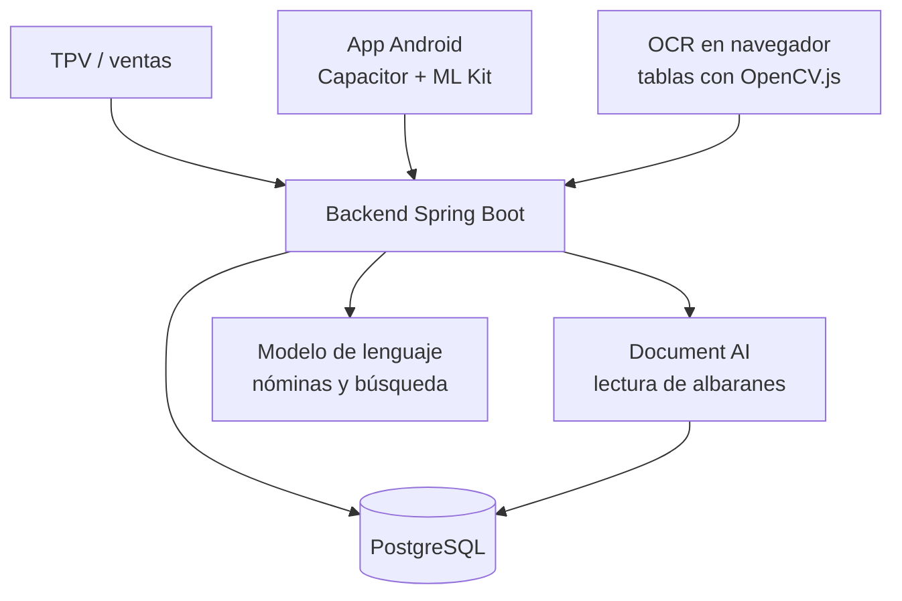

# WilayaCenter Pharma — ERP/TPV para farmacia, con IA aplicada

> Write-up saneado: sin datos de cliente, sin credenciales y sin interioridades de producción.

## De qué va

Plataforma SaaS de ERP y TPV para la operativa de una farmacia, con usuarios reales en Marruecos. Más allá del punto de venta cubre el ciclo completo del negocio: ventas con gestión de lotes, compras con lectura automática de albaranes, inventario, precios, proveedores, contabilidad, IVA, nóminas, control de presencia y turnos de guardia.

- **Backend**: Java 17, Spring Boot 3.5, PostgreSQL. JDBC nativo y JPA según el módulo.
- **Frontend**: React con Mantine y TanStack Query. Empaquetado Android con Capacitor, con escaneo de códigos de barras nativo.
- **Mi papel**: todo. Diseño de producto, backend, frontend, modelo de datos, funciones de IA, despliegue y soporte.

Debajo hay tres decisiones que me parecen las que merecen contarse.

---

## 1. El stock puede quedar negativo, y es a propósito

**El caso.** Al finalizar una venta se descuenta stock por línea y por lote. La versión de manual de eso comprueba que hay existencias y bloquea la venta si no las hay.

**Por qué está mal aquí.** En una farmacia el producto llega físicamente antes de que su albarán se meta en el sistema. El mostrador no puede esperar al papeleo: si bloqueas la venta de algo que está en la estantería, has roto la caja.

**Lo que hace.** La comprobación de stock no está, y el motivo está escrito en el código junto a la decisión: el stock puede quedar negativo cuando el producto todavía no se ha recepcionado, y se regulariza solo al finalizar el albarán. **La regla del dominio gana a la regla del libro**, y queda anotada para que nadie la "arregle" dentro de un año.

**Lo que sí protege ese mismo método**, que es donde está el trabajo de verdad:

- **`SELECT ... FOR UPDATE` sobre la venta.** Dos cajas finalizando la misma venta a la vez no pueden descontar stock dos veces.
- **Idempotencia por bandera.** Si la venta ya está posteada, la segunda llamada no hace nada y lo dice. Un doble clic no duplica movimientos.
- **Una venta cancelada no se puede finalizar**, comprobado explícitamente y no por descarte.
- **La referencia del movimiento es la línea de venta, no el producto.** Eso es lo que permite que una misma línea consuma de varios lotes, que es como funciona FEFO de verdad: primero lo que antes caduca, aunque haya que partir la cantidad entre dos lotes.

---

## 2. Leer albaranes de proveedor sin fiarse del OCR

**El caso.** Meter a mano las líneas de un albarán es el trabajo más repetitivo de la compra. La idea es fotografiarlo y que salgan las líneas.

**El diseño.** El parser usa Document AI y va por prioridades, no por un único camino:

- **Primero las entidades**, que es lo más fiable, y **solo si superan un umbral de confianza**. Un valor con poca confianza no se acepta en silencio.
- **Si no hay entidades, cae a la lectura de tablas.** Peor, pero mejor que nada, y sabiendo que es peor.
- **La referencia del producto se busca por varios sinónimos**, porque cada proveedor llama de otra forma a la misma columna.
- **Los descuentos vienen en euros o en porcentaje**, indistintamente, y hay que calcular los importes que el albarán no trae.

**Y una segunda vía en el navegador.** Para documentos escaneados sencillos hay una extracción de tablas con visión por computador en cliente, con OpenCV.js. Ahorra la llamada al servicio de nube cuando el documento no la necesita.

**Lo que hay debajo de todo esto**: un albarán mal leído no da error, da una línea de compra con una cantidad equivocada. Por eso el umbral de confianza y por eso la revisión del operador antes de confirmar.

---

## 3. Buscar producto en lenguaje natural sin montar embeddings

**El caso.** El mostrador busca por lo que le pide el cliente, no por el nombre exacto del catálogo.

**Lo que hace.** Primero una búsqueda full-text en la base de datos, que devuelve hasta 30 candidatos. Si no hay coincidencia literal, pasa una muestra del catálogo al modelo para que haga la selección semántica. Después se parsea la respuesta y **se vuelve a enriquecer con los datos reales de la base de datos**, para que lo que se muestre sea el producto de verdad y no lo que el modelo recuerde de él.

**La decisión que hay detrás.** La alternativa era montar una búsqueda vectorial con embeddings. Para un catálogo de este tamaño no compensa: hay que generar los vectores, mantenerlos al día con cada alta y cada cambio de nombre, y montar el reindexado. El full-text ya lo resuelve casi siempre, y el modelo solo entra cuando el full-text no encuentra nada.

Es la misma disciplina que en la otra plataforma: **el trabajo caro solo se construye cuando la medida dice que hace falta.**

---

## Qué más hay

**Ventas e inventario.** TPV con ticket, descuento de stock por lote, FEFO en ventas, inventario y compras. Escaneo de códigos de barras en móvil con ML Kit, con resolución rápida de producto en unitario y en lote. Motor de precios por reglas y gestión de presupuestos de proveedor.

**Contabilidad y personal.** Gastos, declaraciones de IVA, cálculo de nómina con horas extra y guardias, control de presencia con cierre semanal automático, y una página pública con la farmacia de guardia.

**IA aplicada.** Además del parseo de albaranes y la búsqueda de producto, resúmenes de nómina en lenguaje natural: los datos de presencia y horas extra se convierten en un texto corto para que el responsable revise, señalando los saldos que necesitan atención, y no dándole una hoja de cálculo.

**Tests.** 14 clases, incluidas pruebas de integración contra una base de datos real en contenedor. Cubren nómina, cálculo de saldos, agregación de horas, vacaciones, y las APIs de producto, proveedor y contabilidad.

## Arquitectura

## Stack

Java 17 · Spring Boot 3.5 · Spring Security · PostgreSQL · Google Cloud Document AI · Google Gemini · React · Mantine · TanStack Query · Capacitor · Android · ML Kit · OpenCV.js · MapStruct · Testcontainers
