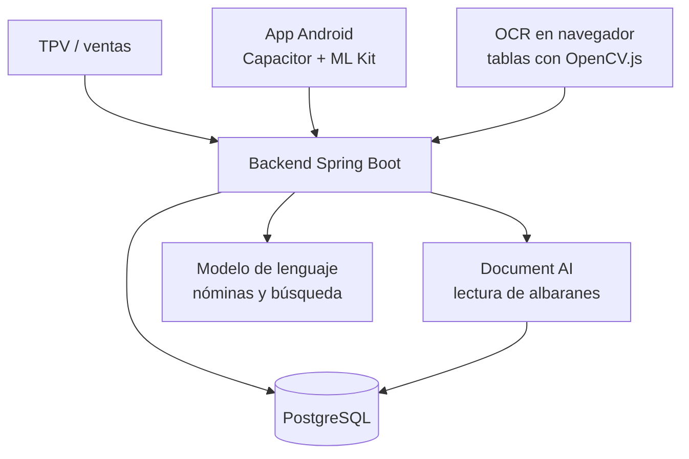

# WilayaCenter Pharma: ERP/TPV para farmacia, con IA aplicada

> Write-up saneado: sin datos de cliente, sin credenciales y sin interioridades de producción.

## Contexto

Plataforma SaaS de ERP y TPV para la operativa de una farmacia, con usuarios reales en Marruecos. Más allá del punto de venta cubre el ciclo completo del negocio: ventas con gestión de lotes, compras con lectura automática de albaranes, inventario, precios, proveedores, contabilidad, IVA, nóminas, control de presencia y turnos de guardia.

- **Backend**: Java 17, Spring Boot 3.5, PostgreSQL. JDBC nativo y JPA según el módulo.
- **Frontend**: React con Mantine y TanStack Query. Empaquetado Android con Capacitor, con escaneo de códigos de barras nativo.
- **Rol**: único desarrollador. Diseño de producto, backend, frontend, modelo de datos, funciones de IA, despliegue y soporte.

---

## 1. Stock negativo admitido por diseño

**Caso.** Al finalizar una venta se descuenta stock por línea y por lote. La implementación habitual valida existencias y bloquea la venta si no las hay.

**Restricción del dominio.** En una farmacia el producto llega físicamente antes de que su albarán entre en el sistema. Bloquear la venta de un producto presente en la estantería detiene el mostrador.

**Implementación.** No hay validación de existencias, y el motivo está documentado en el código junto a la decisión: el stock puede quedar negativo mientras el producto no está recepcionado, y se regulariza al finalizar el albarán. Queda anotado para evitar que se "corrija" más adelante.

**Lo que sí protege ese método:**

- **`SELECT ... FOR UPDATE` sobre la venta.** Dos cajas finalizando la misma venta a la vez no pueden descontar stock dos veces.
- **Idempotencia por bandera.** Si la venta ya está posteada, la segunda llamada no hace nada y lo dice. Un doble clic no duplica movimientos.
- **Una venta cancelada no se puede finalizar**, comprobado explícitamente y no por descarte.
- **La referencia del movimiento es la línea de venta, no el producto.** Así una misma línea puede consumir de varios lotes, que es lo que exige FEFO: sale primero lo que antes caduca, aunque haya que partir la cantidad entre dos lotes.

---

## 2. Lectura de albaranes de proveedor

La introducción manual de las líneas de un albarán es la tarea más repetitiva de la compra. Se fotografía y el parser saca las líneas con Document AI, por prioridades y no por un único camino:

- **Primero las entidades**, que es lo más fiable, y solo si superan un umbral de confianza. Por debajo de él el campo se marca para revisión en lugar de escribirse.
- **Sin entidades, se recurre a la lectura de tablas**, con menor fiabilidad y marcada como tal.
- **La referencia del producto se busca por varios sinónimos**, porque cada proveedor llama de otra forma a la misma columna.
- **Los descuentos vienen en euros o en porcentaje**, indistintamente, y hay que calcular los importes que el albarán no trae.

Para documentos escaneados sencillos hay una segunda vía en el navegador: extracción de tablas con OpenCV.js, que ahorra la llamada al servicio de nube cuando el documento no la necesita.

Un albarán mal leído no produce error, sino una línea de compra con cantidad incorrecta. De ahí el umbral de confianza y la revisión del operador antes de confirmar.

---

## 3. Búsqueda de producto en lenguaje natural, sin embeddings

El mostrador busca por lo que pide el cliente, no por el nombre exacto del catálogo. Primero va una búsqueda full-text en la base de datos, que devuelve hasta 30 candidatos. Si no hay coincidencia literal, pasa una muestra del catálogo al modelo para que haga la selección semántica. Después se parsea la respuesta y **se vuelve a enriquecer con los datos reales de la base de datos**, para que lo que se muestre sea el producto real y no lo que el modelo haya reconstruido de memoria.

La alternativa era montar una búsqueda vectorial con embeddings. Para un catálogo de este tamaño no compensa: hay que generar los vectores, mantenerlos al día con cada alta y cada cambio de nombre, y montar el reindexado. El full-text ya lo resuelve casi siempre, y el modelo solo entra cuando el full-text no encuentra nada.

---

## Resto de módulos

**Ventas e inventario.** TPV con ticket, descuento de stock por lote, FEFO en ventas, inventario y compras. Escaneo de códigos de barras en móvil con ML Kit, con resolución rápida de producto en unitario y en lote. Motor de precios por reglas y gestión de presupuestos de proveedor.

**Contabilidad y personal.** Gastos, declaraciones de IVA, cálculo de nómina con horas extra y guardias, control de presencia con cierre semanal automático, y una página pública con la farmacia de guardia.

**IA aplicada.** Además del parseo de albaranes y la búsqueda de producto, resúmenes de nómina en lenguaje natural: los datos de presencia y horas extra se convierten en un texto corto que señala al responsable los saldos que requieren atención.

**Tests.** 14 clases, incluidas pruebas de integración contra una base de datos real en contenedor. Cubren nómina, cálculo de saldos, agregación de horas, vacaciones, y las APIs de producto, proveedor y contabilidad.

## Arquitectura

## Stack

Java 17 · Spring Boot 3.5 · Spring Security · PostgreSQL · Google Cloud Document AI · Google Gemini · React · Mantine · TanStack Query · Capacitor · Android · ML Kit · OpenCV.js · MapStruct · Testcontainers
