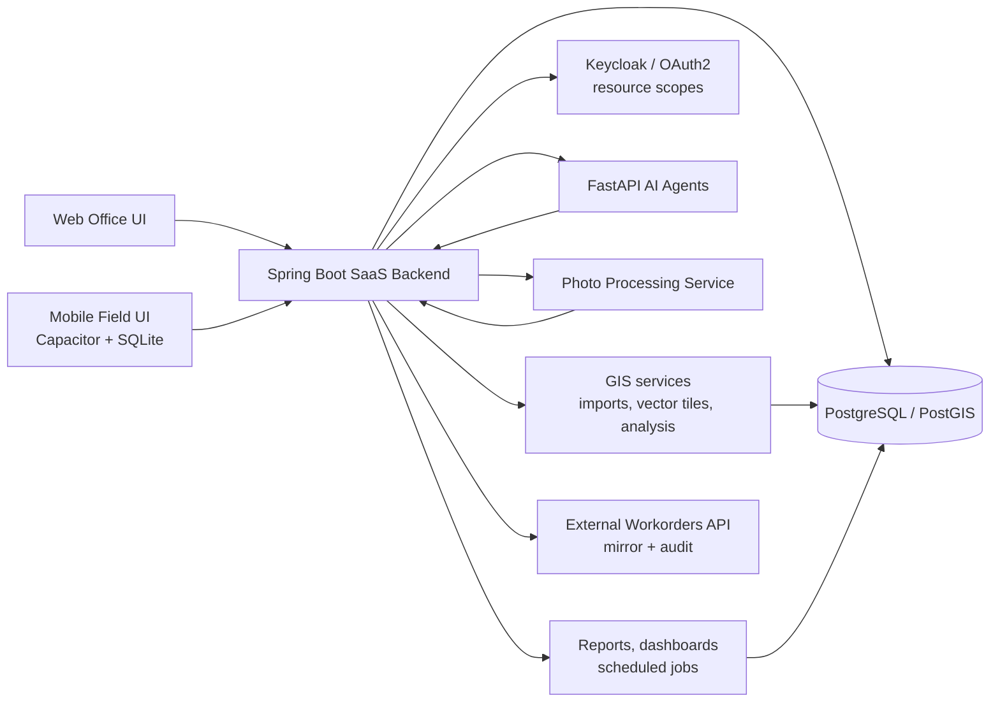
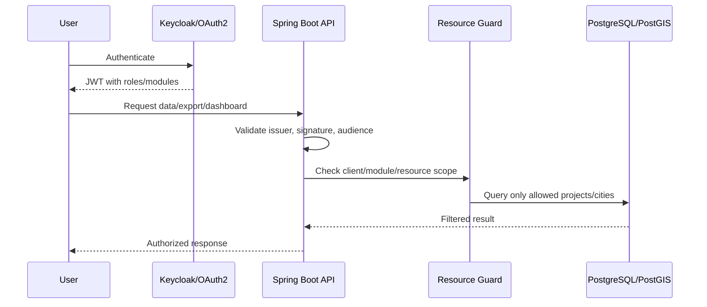
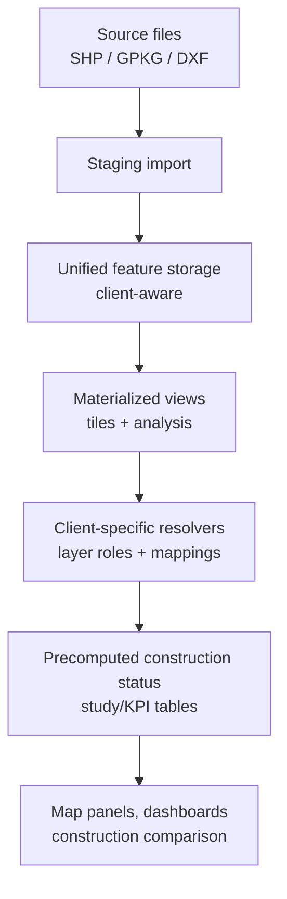
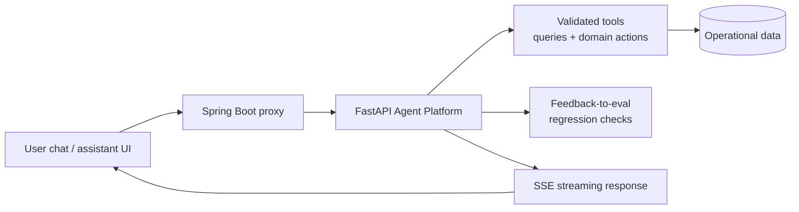
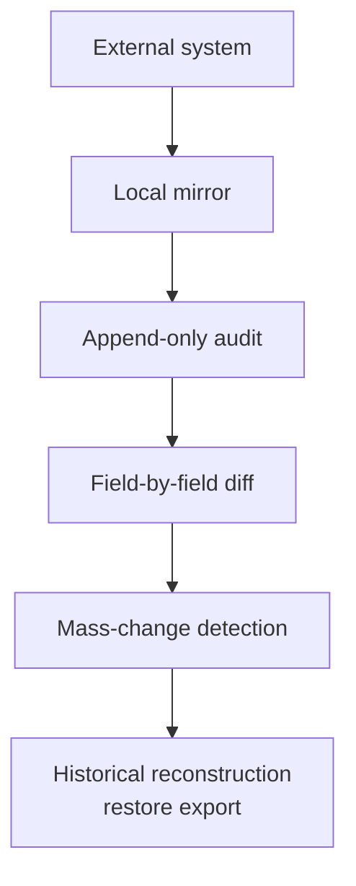

# AppFibra Platform Diagrams

High-level and sanitized — the point is to show how the pieces fit together, not the implementation.

## Platform Architecture

## Identity & Resource Authorization

## Multi-Client GIS Pipeline

## AI Agent Integration

## Production Risk Controls

