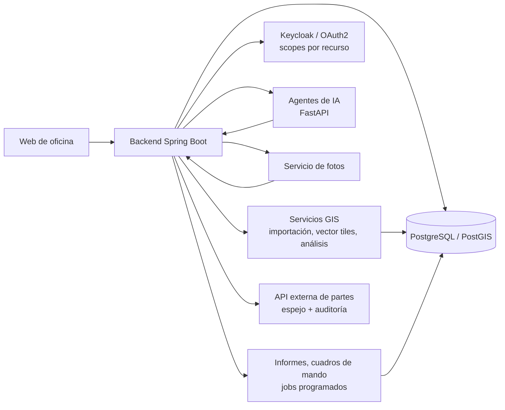
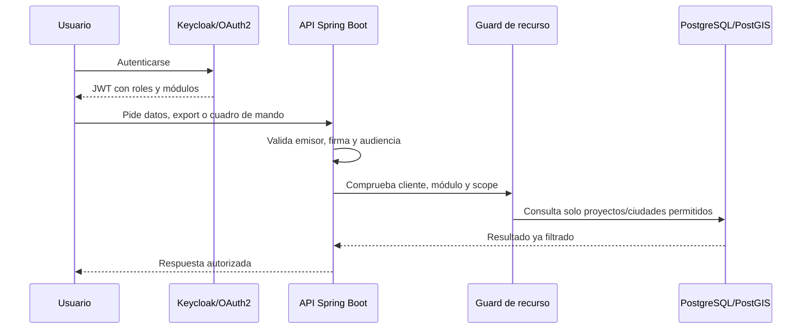
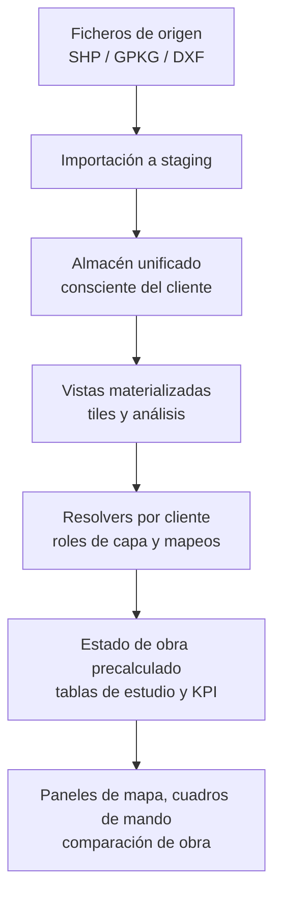
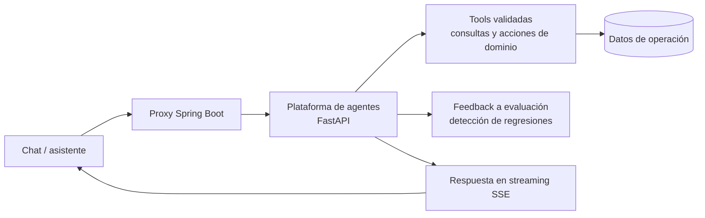
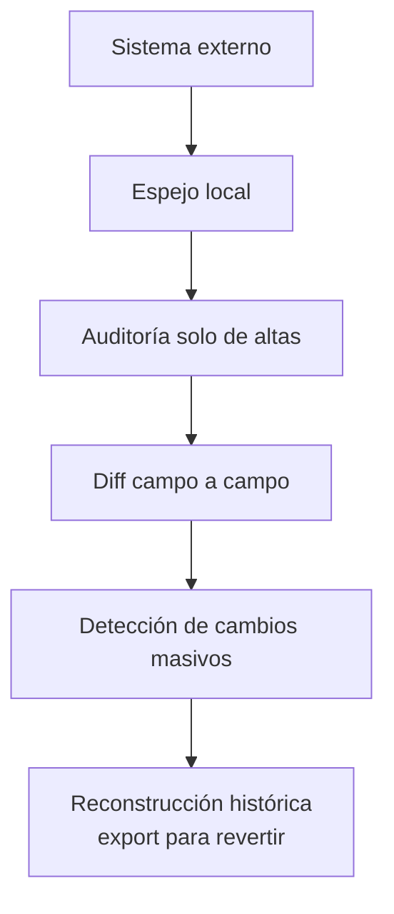

# Diagramas de la plataforma AppFibra

Vista de alto nivel, saneada: cómo encajan las piezas, sin detalle de implementación.

## Arquitectura de la plataforma

## Identidad y autorización por recurso

## Pipeline GIS multicliente

## Integración de los agentes de IA

## Controles de riesgo en producción

